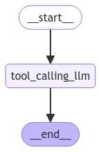

[](https://colab.research.google.com/github/langchain-ai/langchain-academy/blob/main/module-1/chain.ipynb) [](https://academy.langchain.com/courses/take/intro-to-langgraph/lessons/58238466-lesson-4-chain)

[](https://colab.research.google.com/github/langchain-ai/langchain-academy/blob/main/module-1/chain.ipynb) [](https://academy.langchain.com/courses/take/intro-to-langgraph/lessons/58238466-lesson-4-chain)


# Chain 链

## Review 复习

We built a simple graph with nodes, normal edges, and conditional edges.

我们构建了一个包含节点、普通边和条件边的简单图。

## Goals 目标

Now, let's build up to a simple chain that combines 4 concepts.

现在，让我们逐步构建一个简单的链，该链整合了 4 个概念。

* Using [chat messages](https://docs.langchain.com/oss/python/langchain/messages) as our graph state
  - 将 [聊天消息](https://docs.langchain.com/oss/python/langchain/messages) 用作图状态

* Using [chat models](https://docs.langchain.com/oss/python/integrations/chat) in graph nodes
  - 在图节点中使用 [聊天模型](https://docs.langchain.com/oss/python/integrations/chat)

* [Binding tools](https://docs.langchain.com/oss/python/langchain/models#tool-calling) to our chat model
  - 将 [工具绑定](https://docs.langchain.com/oss/python/langchain/models#tool-calling) 到我们的聊天模型

* [Executing tool calls](https://docs.langchain.com/oss/python/langchain/models#tool-execution-loop) in graph nodes 
  - 在图节点中 [执行工具调用](https://docs.langchain.com/oss/python/langchain/models#tool-execution-loop)


```python
%%capture --no-stderr
%pip install --quiet -U langchain_openai langchain_core langgraph
```

## Messages 消息

Chat models can use [messages](https://docs.langchain.com/oss/python/langchain/messages), which capture different roles within a conversation.

聊天模型可以使用 [消息](https://docs.langchain.com/oss/python/langchain/messages)，以捕获对话中不同角色的内容。

LangChain supports various message types, including `HumanMessage`, `AIMessage`, `SystemMessage`, and `ToolMessage`.

LangChain 支持多种消息类型，包括 `HumanMessage`、`AIMessage`、`SystemMessage` 和 `ToolMessage`。

These represent a message from the user, from chat model, for the chat model to instruct behavior, and from a tool call.

这些类型分别代表来自用户的消息、来自聊天模型的消息、用于指示聊天模型行为的系统消息，以及来自工具调用的消息。

Let's create a list of messages.

让我们创建一个消息列表。

Each message can be supplied with a few things:

每条消息可提供以下几项内容：

* `content` - content of the message
  - `content` — 消息内容

* `name` - optionally, a message author 
  - `name` — 可选，消息作者

* `response_metadata` - optionally, a dict of metadata (e.g., often populated by model provider for `AIMessages`)
  - `response_metadata` — 可选，元数据字典（例如，通常由模型提供商为 `AIMessages` 填充）


```python
from pprint import pprint
from langchain_core.messages import AIMessage, HumanMessage

messages = [AIMessage(content=f"So you said you were researching ocean mammals?", name="Model")]
messages.append(HumanMessage(content=f"Yes, that's right.",name="Lance"))
messages.append(AIMessage(content=f"Great, what would you like to learn about.", name="Model"))
messages.append(HumanMessage(content=f"I want to learn about the best place to see Orcas in the US.", name="Lance"))

for m in messages:
    m.pretty_print()
```

    ================================== Ai Message ==================================
    Name: Model
    
    So you said you were researching ocean mammals?
    ================================ Human Message =================================
    Name: Lance
    
    Yes, that's right.
    ================================== Ai Message ==================================
    Name: Model
    
    Great, what would you like to learn about.
    ================================ Human Message =================================
    Name: Lance
    
    I want to learn about the best place to see Orcas in the US.


## Chat Models 聊天模型

Chat models use a sequence of messages as input and support message types, as discussed above.

聊天模型以消息序列为输入，并支持上述消息类型。

There are [many](https://docs.langchain.com/oss/python/integrations/chat) to choose from!

可供选择的模型 [非常多](https://docs.langchain.com/oss/python/integrations/chat)！

Let's work with OpenAI.

我们以 OpenAI 为例进行操作。

Let's check that your `OPENAI_API_KEY` is set and, if not, you will be asked to enter it.

请确认您的 `OPENAI_API_KEY` 已设置；若未设置，系统将提示您输入。


```python
import os, getpass

def _set_env(var: str):
    if not os.environ.get(var):
        os.environ[var] = getpass.getpass(f"{var}: ")

from dotenv import find_dotenv, load_dotenv

load_dotenv(find_dotenv(usecwd=True))
_set_env("OPENAI_API_KEY")
```

We can load a chat model and invoke it with out list of messages.

我们可以加载一个聊天模型，并用我们的消息列表调用它。

We can see that the result is an `AIMessage` with specific `response_metadata`.

可以看到，结果是一个带有特定 `response_metadata` 的 `AIMessage`。


```python
import os
from langchain_openai import ChatOpenAI
llm = ChatOpenAI(model=os.getenv("OPENAI_MODEL", "qwen-plus"), base_url=os.getenv("OPENAI_BASE_URL", "https://dashscope.aliyuncs.com/compatible-mode/v1"))
result = llm.invoke(messages)
type(result)
```


    langchain_core.messages.ai.AIMessage


```python
result
```


    AIMessage(content='One of the best places to see orcas in the United States is the Pacific Northwest, particularly around the San Juan Islands in Washington State. Here are some details:\n\n1. **San Juan Islands, Washington**: These islands are a renowned spot for whale watching, with orcas frequently spotted between late spring and early fall. The waters around the San Juan Islands are home to both resident and transient orca pods, making it an excellent location for sightings.\n\n2. **Puget Sound, Washington**: This area, including places like Seattle and the surrounding waters, offers additional opportunities to see orcas, particularly the Southern Resident killer whale population.\n\n3. **Olympic National Park, Washington**: The coastal areas of the park provide a stunning backdrop for spotting orcas, especially during their migration periods.\n\nWhen planning a trip for whale watching, consider peak seasons for orca activity and book tours with reputable operators who adhere to responsible wildlife viewing practices. Additionally, land-based spots like Lime Kiln Point State Park, also known as “Whale Watch Park,” on San Juan Island, offer great opportunities for orca watching from shore.', additional_kwargs={'refusal': None}, response_metadata={'token_usage': {'completion_tokens': 228, 'prompt_tokens': 67, 'total_tokens': 295, 'completion_tokens_details': {'accepted_prediction_tokens': 0, 'audio_tokens': 0, 'reasoning_tokens': 0, 'rejected_prediction_tokens': 0}, 'prompt_tokens_details': {'audio_tokens': 0, 'cached_tokens': 0}}, 'model_name': 'gpt-4o-2024-08-06', 'system_fingerprint': 'fp_50cad350e4', 'finish_reason': 'stop', 'logprobs': None}, id='run-57ed2891-c426-4452-b44b-15d0a5c3f225-0', usage_metadata={'input_tokens': 67, 'output_tokens': 228, 'total_tokens': 295, 'input_token_details': {'audio': 0, 'cache_read': 0}, 'output_token_details': {'audio': 0, 'reasoning': 0}})


```python
result.response_metadata
```


    {'token_usage': {'completion_tokens': 228,
      'prompt_tokens': 67,
      'total_tokens': 295,
      'completion_tokens_details': {'accepted_prediction_tokens': 0,
       'audio_tokens': 0,
       'reasoning_tokens': 0,
       'rejected_prediction_tokens': 0},
      'prompt_tokens_details': {'audio_tokens': 0, 'cached_tokens': 0}},
     'model_name': 'gpt-4o-2024-08-06',
     'system_fingerprint': 'fp_50cad350e4',
     'finish_reason': 'stop',
     'logprobs': None}


## Tools 工具

Tools are useful whenever you want a model to interact with external systems.

当需要模型与外部系统交互时，工具非常有用。

External systems (e.g., APIs) often require a particular input schema or payload, rather than natural language.

外部系统（例如 API）通常要求特定的输入模式或载荷，而非自然语言。

When we bind an API, for example, as a tool we given the model awareness of the required input schema.

当我们把某个 API（例如）作为工具绑定时，便使模型知晓了所需的输入模式。

The model will choose to call a tool based upon the natural language input from the user.

模型会根据用户的自然语言输入决定是否调用某个工具。

And, it will return an output that adheres to the tool's schema.

并且，其返回的输出将符合该工具的模式。

[Many LLM providers support tool calling](https://docs.langchain.com/oss/python/integrations/chat) and [tool calling interface](https://blog.langchain.com/improving-core-tool-interfaces-and-docs-in-langchain/) in LangChain is simple.

[许多 LLM 提供商支持工具调用](https://docs.langchain.com/oss/python/integrations/chat)，而 LangChain 中的 [工具调用接口](https://blog.langchain.com/improving-core-tool-interfaces-and-docs-in-langchain/) 简单易用。

You can simply pass any Python `function` into `ChatModel.bind_tools(function)`.

您只需将任意 Python `function` 传入 `ChatModel.bind_tools(function)` 即可。


Let's showcase a simple example of tool calling!

让我们展示一个简单的工具调用示例！

The `multiply` function is our tool.

`multiply` 函数即为我们的工具。


```python
def multiply(a: int, b: int) -> int:
    """Multiply a and b.

    Args:
        a: first int
        b: second int
    """
    return a * b

llm_with_tools = llm.bind_tools([multiply])
```

If we pass an input - e.g., `"What is 2 multiplied by 3"` - we see a tool call returned.

如果我们传入一个输入（例如：`"2 乘以 3 是多少？"`），便会返回一个工具调用。

The tool call has specific arguments that match the input schema of our function along with the name of the function to call.

该工具调用具有与函数输入模式匹配的具体参数，以及待调用函数的名称。

```
{'arguments': '{"a":2,"b":3}', 'name': 'multiply'}
```


```python
tool_call = llm_with_tools.invoke([HumanMessage(content=f"What is 2 multiplied by 3", name="Lance")])
```


```python
tool_call.tool_calls
```


    [{'name': 'multiply',
      'args': {'a': 2, 'b': 3},
      'id': 'call_lBBBNo5oYpHGRqwxNaNRbsiT',
      'type': 'tool_call'}]


## Using messages as state 将消息用作状态

With these foundations in place, we can now use  [messages](https://docs.langchain.com/oss/python/langchain/overview#messages) in our graph state.

在奠定这些基础后，我们现在可在图状态中使用 [消息](https://docs.langchain.com/oss/python/langchain/overview#messages)。

Let's define our state, `MessagesState`, as a `TypedDict` with a single key: `messages`.

让我们将状态 `MessagesState` 定义为一个仅含单个键 `messages` 的 `TypedDict`。

`messages` is simply a list of messages, as we defined above (e.g., `HumanMessage`, etc).

`messages` 即为我们上文定义的消息列表（例如 `HumanMessage` 等）。


```python
from typing_extensions import TypedDict
from langchain_core.messages import AnyMessage

class MessagesState(TypedDict):
    messages: list[AnyMessage]
```

## Reducers 归约器

Now, we have a minor problem!

现在，我们遇到了一个小问题！

As we discussed, each node will return a new value for our state key `messages`.

如前所述，每个节点都会为状态键 `messages` 返回一个新值。

But, this new value will overwrite the prior `messages` value!

但该新值将覆盖先前的 `messages` 值！

As our graph runs, we want to **append** messages to our `messages` state key.

随着图运行，我们希望将消息 **追加** 到 `messages` 状态键中。

We can use [reducer functions](https://docs.langchain.com/oss/python/langgraph/graph-api#reducers) to address this.

我们可以使用 [归约函数](https://docs.langchain.com/oss/python/langgraph/graph-api#reducers) 来解决此问题。

Reducers specify how state updates are performed.

归约器指定了状态更新的执行方式。

If no reducer function is specified, then it is assumed that updates to the key should *override it* as we saw before.

若未指定归约函数，则默认对键的更新将 *覆盖原有值*（如前所见）。

But, to append messages, we can use the pre-built `add_messages` reducer.

但为了追加消息，我们可以使用预置的 `add_messages` 归约器。

This ensures that any messages are appended to the existing list of messages.

这确保所有消息均被追加至现有消息列表末尾。

We simply need to annotate our `messages` key with the `add_messages` reducer function as metadata.

我们只需将 `add_messages` 归约函数作为元数据标注到 `messages` 键上即可。


```python
from typing import Annotated
from langgraph.graph.message import add_messages

class MessagesState(TypedDict):
    messages: Annotated[list[AnyMessage], add_messages]
```

Since having a list of messages in graph state is so common, LangGraph has a pre-built  [`MessagesState`](https://docs.langchain.com/oss/python/langgraph/graph-api#messagesstate)!

由于在图状态中使用消息列表极为常见，LangGraph 提供了预置的 [`MessagesState`](https://docs.langchain.com/oss/python/langgraph/graph-api#messagesstate)！

`MessagesState` is defined:

`MessagesState` 的定义如下：

* With a pre-build single `messages` key
  - 预置单一 `messages` 键

* This is a list of `AnyMessage` objects 
  - 该键为 `AnyMessage` 对象列表

* It uses the `add_messages` reducer
  - 使用 `add_messages` 归约器

We'll usually use `MessagesState` because it is less verbose than defining a custom `TypedDict`, as shown above.

我们通常使用 `MessagesState`，因为它比上文所示自定义 `TypedDict` 更简洁。


```python
from langgraph.graph import MessagesState

class MessagesState(MessagesState):
    # Add any keys needed beyond messages, which is pre-built 
    pass
```

To go a bit deeper, we can see how the `add_messages` reducer works in isolation.

更深入一步，我们可以单独观察 `add_messages` 归约器的工作原理。


```python
# Initial state
initial_messages = [AIMessage(content="Hello! How can I assist you?", name="Model"),
                    HumanMessage(content="I'm looking for information on marine biology.", name="Lance")
                   ]

# New message to add
new_message = AIMessage(content="Sure, I can help with that. What specifically are you interested in?", name="Model")

# Test
add_messages(initial_messages , new_message)
```


    [AIMessage(content='Hello! How can I assist you?', name='Model', id='cd566566-0f42-46a4-b374-fe4d4770ffa7'),
     HumanMessage(content="I'm looking for information on marine biology.", name='Lance', id='9b6c4ddb-9de3-4089-8d22-077f53e7e915'),
     AIMessage(content='Sure, I can help with that. What specifically are you interested in?', name='Model', id='74a549aa-8b8b-48d4-bdf1-12e98404e44e')]


## Our graph 我们的图

Now, lets use `MessagesState` with a graph.

现在，让我们将 `MessagesState` 与一个图结合使用。


```python
from IPython.display import Image, display
from langgraph.graph import StateGraph, START, END
    
# Node
def tool_calling_llm(state: MessagesState):
    return {"messages": [llm_with_tools.invoke(state["messages"])]}

# Build graph
builder = StateGraph(MessagesState)
builder.add_node("tool_calling_llm", tool_calling_llm)
builder.add_edge(START, "tool_calling_llm")
builder.add_edge("tool_calling_llm", END)
graph = builder.compile()

# View
display(Image(graph.get_graph().draw_mermaid_png()))
```


    

    


If we pass in `Hello!`, the LLM responds without any tool calls.

如果我们传入 `Hello!`，大语言模型（LLM）将不调用任何工具直接响应。


```python
messages = graph.invoke({"messages": HumanMessage(content="Hello!")})
for m in messages['messages']:
    m.pretty_print()
```

    ================================ Human Message =================================
    
    Hello!
    ================================== Ai Message ==================================
    
    Hi there! How can I assist you today?


The LLM chooses to use a tool when it determines that the input or task requires the functionality provided by that tool.

当大语言模型（LLM）判断输入或任务需要某个工具所提供的功能时，它会选择使用该工具。


```python
messages = graph.invoke({"messages": HumanMessage(content="Multiply 2 and 3")})
for m in messages['messages']:
    m.pretty_print()
```

    ================================ Human Message =================================
    
    Multiply 2 and 3!
    ================================== Ai Message ==================================
    Tool Calls:
      multiply (call_Er4gChFoSGzU7lsuaGzfSGTQ)
     Call ID: call_Er4gChFoSGzU7lsuaGzfSGTQ
      Args:
        a: 2
        b: 3


```python

```
