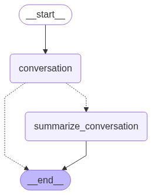

[](https://colab.research.google.com/github/langchain-ai/langchain-academy/blob/main/module-2/chatbot-summarization.ipynb) [](https://academy.langchain.com/courses/take/intro-to-langgraph/lessons/58239436-lesson-5-chatbot-w-summarizing-messages-and-memory)

[](https://colab.research.google.com/github/langchain-ai/langchain-academy/blob/main/module-2/chatbot-summarization.ipynb) [](https://academy.langchain.com/courses/take/intro-to-langgraph/lessons/58239436-lesson-5-chatbot-w-summarizing-messages-and-memory)


# Chatbot with message summarization 支持消息摘要的聊天机器人

## Review 回顾

We've covered how to customize graph state schema and reducer.

我们已介绍如何自定义图状态模式（schema）和规约器（reducer）。

We've also shown a number of ways to trim or filter messages in graph state.

我们还展示了多种在图状态中裁剪或过滤消息的方法。

## Goals 目标

Now, let's take it one step further!

现在，让我们更进一步！

Rather than just trimming or filtering messages, we'll show how to use LLMs to produce a running summary of the conversation.

我们将不仅裁剪或过滤消息，还将演示如何使用 LLM 生成对话的持续摘要。

This allows us to retain a compressed representation of the full conversation, rather than just removing it with trimming or filtering.

这使我们能够保留整个对话的压缩表示，而非仅通过裁剪或过滤将其移除。

We'll incorporate this summarization into a simple Chatbot.

我们将把该摘要功能整合进一个简单的聊天机器人中。

And we'll equip that Chatbot with memory, supporting long-running conversations without incurring high token cost / latency.

我们还将为该聊天机器人配备记忆能力，以支持长时间运行的对话，同时避免高昂的 token 开销 / 延迟。


```python
%%capture --no-stderr
%pip install --quiet -U langchain_core langgraph langchain_openai
```


```python
import os, getpass

def _set_env(var: str):
    if not os.environ.get(var):
        os.environ[var] = getpass.getpass(f"{var}: ")

from dotenv import find_dotenv, load_dotenv

load_dotenv(find_dotenv(usecwd=True))
_set_env("OPENAI_API_KEY")
```

We'll use [LangSmith](https://docs.langchain.com/langsmith/home) for  [tracing](https://docs.langchain.com/langsmith/observability-concepts).

我们将使用 [LangSmith](https://docs.langchain.com/langsmith/home) 进行 [追踪（tracing）](https://docs.langchain.com/langsmith/observability-concepts)。


```python
_set_env("LANGSMITH_API_KEY")
os.environ["LANGSMITH_TRACING"] = "true"
os.environ["LANGSMITH_PROJECT"] = "langchain-academy"
```


```python
import os
from langchain_openai import ChatOpenAI
model = ChatOpenAI(model=os.getenv("OPENAI_MODEL", "qwen-plus"), base_url=os.getenv("OPENAI_BASE_URL", "https://dashscope.aliyuncs.com/compatible-mode/v1"),temperature=0)
```

We'll use `MessagesState`, as before.

我们将继续使用 `MessagesState`。

In addition to the built-in `messages` key, we'll now include a custom key (`summary`).

除内置的 `messages` 键外，我们现在还将添加一个自定义键（`summary`）。


```python
from langgraph.graph import MessagesState
class State(MessagesState):
    summary: str
```

We'll define a node to call our LLM that incorporates a summary, if it exists, into the prompt.

我们将定义一个节点，用于调用我们的 LLM；该节点会在提示词（prompt）中纳入已有摘要（如果存在）。


```python
from langchain_core.messages import SystemMessage, HumanMessage, RemoveMessage

# Define the logic to call the model
def call_model(state: State):
    
    # Get summary if it exists
    summary = state.get("summary", "")

    # If there is summary, then we add it
    if summary:
        
        # Add summary to system message
        system_message = f"Summary of conversation earlier: {summary}"

        # Append summary to any newer messages
        messages = [SystemMessage(content=system_message)] + state["messages"]
    
    else:
        messages = state["messages"]
    
    response = model.invoke(messages)
    return {"messages": response}
```

We'll define a node to produce a summary.

我们将定义一个用于生成摘要的节点。

Note, here we'll use `RemoveMessage` to filter our state after we've produced the summary.

注意：此处我们将使用 `RemoveMessage` 在生成摘要后对状态进行过滤。


```python
def summarize_conversation(state: State):
    
    # First, we get any existing summary
    summary = state.get("summary", "")

    # Create our summarization prompt 
    if summary:
        
        # A summary already exists
        summary_message = (
            f"This is summary of the conversation to date: {summary}\n\n"
            "Extend the summary by taking into account the new messages above:"
        )
        
    else:
        summary_message = "Create a summary of the conversation above:"

    # Add prompt to our history
    messages = state["messages"] + [HumanMessage(content=summary_message)]
    response = model.invoke(messages)
    
    # Delete all but the 2 most recent messages
    delete_messages = [RemoveMessage(id=m.id) for m in state["messages"][:-2]]
    return {"summary": response.content, "messages": delete_messages}
```

We'll add a conditional edge to determine whether to produce a summary based on the conversation length.

我们将添加一条条件边，根据对话长度决定是否生成摘要。


```python
from langgraph.graph import END
from typing_extensions import Literal
# Determine whether to end or summarize the conversation
def should_continue(state: State) -> Literal ["summarize_conversation",END]:
    
    """Return the next node to execute."""
    
    messages = state["messages"]
    
    # If there are more than six messages, then we summarize the conversation
    if len(messages) > 6:
        return "summarize_conversation"
    
    # Otherwise we can just end
    return END
```

## Adding memory 添加记忆

Recall that [state is transient](https://github.com/langchain-ai/langgraph/discussions/352#discussioncomment-9291220) to a single graph execution.

请记住，[状态在单次图执行中是临时的（transient）](https://github.com/langchain-ai/langgraph/discussions/352#discussioncomment-9291220)。

This limits our ability to have multi-turn conversations with interruptions.

这限制了我们处理带中断的多轮对话的能力。

As introduced at the end of Module 1, we can use [persistence](https://docs.langchain.com/oss/python/langgraph/persistence) to address this!

如模块 1 末尾所介绍，我们可以使用 [持久化（persistence）](https://docs.langchain.com/oss/python/langgraph/persistence) 来解决此问题！

LangGraph can use a checkpointer to automatically save the graph state after each step.

LangGraph 可借助检查点器（checkpointer）在每一步之后自动保存图状态。

This built-in persistence layer provides memory, allowing LangGraph to resume from the last state update.

这一内置持久化层提供了记忆能力，使 LangGraph 能从上一次状态更新处恢复执行。

As we previously showed, one of the easiest to work with is `MemorySaver`, an in-memory key-value store for Graph state.

如前所示，其中最容易使用的之一是 `MemorySaver` —— 一种用于图状态的内存内键值存储。

All we need to do is compile the graph with a checkpointer, and our graph has memory!

我们只需在编译图时传入一个检查点器，该图便具备了记忆能力！


```python
from IPython.display import Image, display
from langgraph.checkpoint.memory import MemorySaver
from langgraph.graph import StateGraph, START

# Define a new graph
workflow = StateGraph(State)
workflow.add_node("conversation", call_model)
workflow.add_node(summarize_conversation)

# Set the entrypoint as conversation
workflow.add_edge(START, "conversation")
workflow.add_conditional_edges("conversation", should_continue)
workflow.add_edge("summarize_conversation", END)

# Compile
memory = MemorySaver()
graph = workflow.compile(checkpointer=memory)
display(Image(graph.get_graph().draw_mermaid_png()))
```


    

    


## Threads 线程（Threads）

The checkpointer saves the state at each step as a checkpoint.

检查点器会将每一步的状态作为检查点保存。

These saved checkpoints can be grouped into a `thread` of conversation.

这些已保存的检查点可被归组为一个对话“线程（thread）”。

Think about Slack as an analog: different channels carry different conversations.

可类比 Slack：不同频道承载不同对话。

Threads are like Slack channels, capturing grouped collections of state (e.g., conversation).

线程类似于 Slack 频道，用于捕获一组有组织的状态（例如对话）。

Below, we use `configurable` to set a thread ID.

下方我们使用 `configurable` 设置线程 ID。


```python
# Create a thread
config = {"configurable": {"thread_id": "1"}}

# Start conversation
input_message = HumanMessage(content="hi! I'm Lance")
output = graph.invoke({"messages": [input_message]}, config) 
for m in output['messages'][-1:]:
    m.pretty_print()

input_message = HumanMessage(content="what's my name?")
output = graph.invoke({"messages": [input_message]}, config) 
for m in output['messages'][-1:]:
    m.pretty_print()

input_message = HumanMessage(content="i like the 49ers!")
output = graph.invoke({"messages": [input_message]}, config) 
for m in output['messages'][-1:]:
    m.pretty_print()
```

    ================================== Ai Message ==================================
    
    Hello Lance! How can I assist you today?
    ================================== Ai Message ==================================
    
    You mentioned that your name is Lance. How can I help you today?
    ================================== Ai Message ==================================
    
    That's great! The San Francisco 49ers have a rich history and a passionate fan base. Do you have a favorite player or a memorable game that you particularly enjoyed?


Now, we don't yet have a summary of the state because we still have < = 6 messages.

目前，我们尚无状态摘要，因为我们仍只有 ≤ 6 条消息。

This was set in `should_continue`.

该阈值在 `should_continue` 中设定。

```
    # If there are more than six messages, then we summarize the conversation
    if len(messages) > 6:
        return "summarize_conversation"
```

We can pick up the conversation because we have the thread.

由于我们拥有线程，因此可以继续之前的对话。


```python
graph.get_state(config).values.get("summary","")
```


    ''


The `config` with thread ID allows us to proceed from the previously logged state!

携带线程 ID 的 `config` 使我们能从先前记录的状态继续执行！


```python
input_message = HumanMessage(content="i like Nick Bosa, isn't he the highest paid defensive player?")
output = graph.invoke({"messages": [input_message]}, config) 
for m in output['messages'][-1:]:
    m.pretty_print()
```

    ================================== Ai Message ==================================
    
    Yes, as of September 2023, Nick Bosa became the highest-paid defensive player in NFL history. He signed a five-year contract extension with the San Francisco 49ers worth $170 million, with $122.5 million guaranteed. Bosa is known for his exceptional skills as a defensive end and has been a key player for the 49ers.


```python
graph.get_state(config).values.get("summary","")
```


    'Lance introduced himself and mentioned that he is a fan of the San Francisco 49ers, specifically highlighting his admiration for Nick Bosa. The conversation noted that as of September 2023, Nick Bosa became the highest-paid defensive player in NFL history with a five-year, $170 million contract extension with the 49ers.'


## LangSmith

Let's review the trace!

让我们回顾一下追踪结果！
