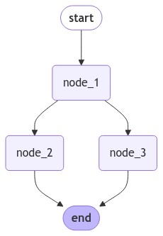
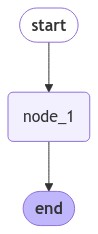

[](https://colab.research.google.com/github/langchain-ai/langchain-academy/blob/main/module-2/state-reducers.ipynb) [](https://academy.langchain.com/courses/take/intro-to-langgraph/lessons/58239428-lesson-2-state-reducers)

[](https://colab.research.google.com/github/langchain-ai/langchain-academy/blob/main/module-2/state-reducers.ipynb) [](https://academy.langchain.com/courses/take/intro-to-langgraph/lessons/58239428-lesson-2-state-reducers)


# State Reducers  状态归约器

## Review 复习

We covered a few different ways to define LangGraph state schema, including `TypedDict`, `Pydantic`, or `Dataclasses`.

我们介绍了几种定义 LangGraph 状态模式的方法，包括 `TypedDict`、`Pydantic` 或 `Dataclasses`。

## Goals 目标

Now, we're going to dive into reducers, which specify how state updates are performed on specific keys / channels in the state schema.

接下来，我们将深入探讨归约器（reducers），它用于指定如何对状态模式中的特定键 / 通道执行状态更新。


```python
%%capture --no-stderr
%pip install --quiet -U langchain_core langgraph
```

## Default overwriting state 默认的覆盖式状态更新

Let's use a `TypedDict` as our state schema.

我们以 `TypedDict` 作为状态模式。


```python
from typing_extensions import TypedDict
from IPython.display import Image, display
from langgraph.graph import StateGraph, START, END

class State(TypedDict):
    foo: int

def node_1(state):
    print("---Node 1---")
    return {"foo": state['foo'] + 1}

# Build graph
builder = StateGraph(State)
builder.add_node("node_1", node_1)

# Logic
builder.add_edge(START, "node_1")
builder.add_edge("node_1", END)

# Add
graph = builder.compile()

# View
display(Image(graph.get_graph().draw_mermaid_png()))
```


    

    


```python
graph.invoke({"foo" : 1})
```

    ---Node 1---


    {'foo': 2}


Let's look at the state update, `return {"foo": state['foo'] + 1}`.

我们来看状态更新语句：`return {"foo": state['foo'] + 1}`。

As discussed before, by default LangGraph doesn't know the preferred way to update the state.

如前所述，默认情况下 LangGraph 并不知道首选的状态更新方式。

So, it will just overwrite the value of `foo` in `node_1`:

因此，它将直接在 `node_1` 中覆盖 `foo` 的值：

```
return {"foo": state['foo'] + 1}
```

If we pass `{'foo': 1}` as input, the state returned from the graph is `{'foo': 2}`.

如果我们传入 `{'foo': 1}` 作为输入，则图返回的状态为 `{'foo': 2}`。

## Branching 分支

Let's look at a case where our nodes branch.

我们来看一个节点发生分支的情形。


```python
class State(TypedDict):
    foo: int

def node_1(state):
    print("---Node 1---")
    return {"foo": state['foo'] + 1}

def node_2(state):
    print("---Node 2---")
    return {"foo": state['foo'] + 1}

def node_3(state):
    print("---Node 3---")
    return {"foo": state['foo'] + 1}

# Build graph
builder = StateGraph(State)
builder.add_node("node_1", node_1)
builder.add_node("node_2", node_2)
builder.add_node("node_3", node_3)

# Logic
builder.add_edge(START, "node_1")
builder.add_edge("node_1", "node_2")
builder.add_edge("node_1", "node_3")
builder.add_edge("node_2", END)
builder.add_edge("node_3", END)

# Add
graph = builder.compile()

# View
display(Image(graph.get_graph().draw_mermaid_png()))
```


    

    


```python
from langgraph.errors import InvalidUpdateError
try:
    graph.invoke({"foo" : 1})
except InvalidUpdateError as e:
    print(f"InvalidUpdateError occurred: {e}")

```

    ---Node 1---
    ---Node 2---
    ---Node 3---
    InvalidUpdateError occurred: At key 'foo': Can receive only one value per step. Use an Annotated key to handle multiple values.


We see a problem!

我们发现了一个问题！

Node 1 branches to nodes 2 and 3.

节点 1 分支至节点 2 和节点 3。

Nodes 2 and 3 run in parallel, which means they run in the same step of the graph.

节点 2 和节点 3 并行运行，这意味着它们在同一图步（step）中执行。

They both attempt to overwrite the state *within the same step*.

它们都试图在同一图步内覆盖状态。

This is ambiguous for the graph!

这对图而言是模糊不清的！

Which state should it keep?

它应保留哪一个状态？


## Reducers 归约器

[Reducers](https://docs.langchain.com/oss/python/langgraph/graph-api/#reducers) give us a general way to address this problem.

[归约器](https://docs.langchain.com/oss/python/langgraph/graph-api/#reducers) 为我们提供了一种通用方法来解决此问题。

They specify how to perform updates.

它们指定了如何执行更新。

We can use the `Annotated` type to specify a reducer function.

我们可以使用 `Annotated` 类型来指定一个归约函数。

For example, in this case let's append the value returned from each node rather than overwriting them.

例如，在本例中，我们选择将每个节点返回的值追加到列表中，而非覆盖它们。

We just need a reducer that can perform this: `operator.add` is a function from Python's built-in operator module.

我们只需一个能实现该功能的归约器：`operator.add` 是 Python 内置 `operator` 模块中的一个函数。

When `operator.add` is applied to lists, it performs list concatenation.

当 `operator.add` 应用于列表时，它执行的是列表拼接（concatenation）。


```python
from operator import add
from typing import Annotated

class State(TypedDict):
    foo: Annotated[list[int], add]

def node_1(state):
    print("---Node 1---")
    return {"foo": [state['foo'][0] + 1]}

# Build graph
builder = StateGraph(State)
builder.add_node("node_1", node_1)

# Logic
builder.add_edge(START, "node_1")
builder.add_edge("node_1", END)

# Add
graph = builder.compile()

# View
display(Image(graph.get_graph().draw_mermaid_png()))
```


    

    


```python
graph.invoke({"foo" : [1]})
```

    ---Node 1---


    {'foo': [1, 2]}


Now, our state key `foo` is a list.

现在，我们的状态键 `foo` 是一个列表。

This `operator.add` reducer function will append updates from each node to this list.

这个 `operator.add` 归约函数会将每个节点的更新追加到该列表中。


```python
def node_1(state):
    print("---Node 1---")
    return {"foo": [state['foo'][-1] + 1]}

def node_2(state):
    print("---Node 2---")
    return {"foo": [state['foo'][-1] + 1]}

def node_3(state):
    print("---Node 3---")
    return {"foo": [state['foo'][-1] + 1]}

# Build graph
builder = StateGraph(State)
builder.add_node("node_1", node_1)
builder.add_node("node_2", node_2)
builder.add_node("node_3", node_3)

# Logic
builder.add_edge(START, "node_1")
builder.add_edge("node_1", "node_2")
builder.add_edge("node_1", "node_3")
builder.add_edge("node_2", END)
builder.add_edge("node_3", END)

# Add
graph = builder.compile()

# View
display(Image(graph.get_graph().draw_mermaid_png()))
```


    

    


We can see that updates in nodes 2 and 3 are performed concurrently because they are in the same step.

我们可以看到，节点 2 和节点 3 中的更新是并发执行的，因为它们处于同一图步中。


```python
graph.invoke({"foo" : [1]})
```

    ---Node 1---
    ---Node 2---
    ---Node 3---


    {'foo': [1, 2, 3, 3]}


Now, let's see what happens if we pass `None` to `foo`.

现在，让我们看看当向 `foo` 传入 `None` 时会发生什么。

We see an error because our reducer, `operator.add`, attempts to concatenate `NoneType` pass as input to list in `node_1`.

我们会看到一个错误，因为我们的归约器 `operator.add` 尝试将传入 `node_1` 的 `NoneType` 与列表进行拼接。


```python
try:
    graph.invoke({"foo" : None})
except TypeError as e:
    print(f"TypeError occurred: {e}")
```

    TypeError occurred: can only concatenate list (not "NoneType") to list


## Custom Reducers 自定义归约器

To address cases like this,[we can also define custom reducers](https://docs.langchain.com/oss/python/langgraph/use-graph-api#process-state-updates-with-reducers).

为应对这类情况，[我们还可以定义自定义归约器](https://docs.langchain.com/oss/python/langgraph/use-graph-api#process-state-updates-with-reducers)。

For example, lets define custom reducer logic to combine lists and handle cases where either or both of the inputs might be `None`.

例如，我们定义一个自定义归约逻辑，用于合并列表，并处理任一或两个输入均为 `None` 的情形。


```python
def reduce_list(left: list | None, right: list | None) -> list:
    """Safely combine two lists, handling cases where either or both inputs might be None.

    Args:
        left (list | None): The first list to combine, or None.
        right (list | None): The second list to combine, or None.

    Returns:
        list: A new list containing all elements from both input lists.
               If an input is None, it's treated as an empty list.
    """
    if not left:
        left = []
    if not right:
        right = []
    return left + right

class DefaultState(TypedDict):
    foo: Annotated[list[int], add]

class CustomReducerState(TypedDict):
    foo: Annotated[list[int], reduce_list]
```

In `node_1`, we append the value 2.

在 `node_1` 中，我们追加数值 2。


```python
def node_1(state):
    print("---Node 1---")
    return {"foo": [2]}

# Build graph
builder = StateGraph(DefaultState)
builder.add_node("node_1", node_1)

# Logic
builder.add_edge(START, "node_1")
builder.add_edge("node_1", END)

# Add
graph = builder.compile()

# View
display(Image(graph.get_graph().draw_mermaid_png()))

try:
    print(graph.invoke({"foo" : None}))
except TypeError as e:
    print(f"TypeError occurred: {e}")
```


    

    


    TypeError occurred: can only concatenate list (not "NoneType") to list


Now, try with our custom reducer.

现在，尝试使用我们的自定义归约器。

We can see that no error is thrown.

我们可以看到，没有抛出任何错误。


```python
# Build graph
builder = StateGraph(CustomReducerState)
builder.add_node("node_1", node_1)

# Logic
builder.add_edge(START, "node_1")
builder.add_edge("node_1", END)

# Add
graph = builder.compile()

# View
display(Image(graph.get_graph().draw_mermaid_png()))

try:
    print(graph.invoke({"foo" : None}))
except TypeError as e:
    print(f"TypeError occurred: {e}")
```


    

    


    ---Node 1---
    {'foo': [2]}


## Messages 消息

In module 1, we showed how to use a built-in reducer, `add_messages`, to handle messages in state.

在模块 1 中，我们展示了如何使用内置归约器 `add_messages` 来处理状态中的消息。

We also showed that [`MessagesState` is a useful shortcut if you want to work with messages](https://docs.langchain.com/oss/python/langgraph/use-graph-api#messagesstate).

我们还展示了 [`MessagesState` 是一个非常有用的快捷方式，适用于需要处理消息的场景](https://docs.langchain.com/oss/python/langgraph/use-graph-api#messagesstate)。

* `MessagesState` has a built-in `messages` key 
  - `MessagesState` 具有一个内置的 `messages` 键

* It also has a built-in `add_messages` reducer for this key
  - 它还为此键内置了 `add_messages` 归约器

These two are equivalent.

这两者是等价的。

We'll use the `MessagesState` class via `from langgraph.graph import MessagesState` for brevity.

为简洁起见，我们将通过 `from langgraph.graph import MessagesState` 使用 `MessagesState` 类。


```python
from typing import Annotated
from langgraph.graph import MessagesState
from langchain_core.messages import AnyMessage
from langgraph.graph.message import add_messages

# Define a custom TypedDict that includes a list of messages with add_messages reducer
class CustomMessagesState(TypedDict):
    messages: Annotated[list[AnyMessage], add_messages]
    added_key_1: str
    added_key_2: str
    # etc

# Use MessagesState, which includes the messages key with add_messages reducer
class ExtendedMessagesState(MessagesState):
    # Add any keys needed beyond messages, which is pre-built 
    added_key_1: str
    added_key_2: str
    # etc
```

Let's talk a bit more about usage of the `add_messages` reducer.

让我们更详细地讨论一下 `add_messages` 归约器的用法。


```python
from langgraph.graph.message import add_messages
from langchain_core.messages import AIMessage, HumanMessage

# Initial state
initial_messages = [AIMessage(content="Hello! How can I assist you?", name="Model"),
                    HumanMessage(content="I'm looking for information on marine biology.", name="Lance")
                   ]

# New message to add
new_message = AIMessage(content="Sure, I can help with that. What specifically are you interested in?", name="Model")

# Test
add_messages(initial_messages , new_message)
```


    [AIMessage(content='Hello! How can I assist you?', name='Model', id='f470d868-cf1b-45b2-ae16-48154cd55c12'),
     HumanMessage(content="I'm looking for information on marine biology.", name='Lance', id='a07a88c5-cb2a-4cbd-9485-5edb9d658366'),
     AIMessage(content='Sure, I can help with that. What specifically are you interested in?', name='Model', id='7938e615-86c2-4cbb-944b-c9b2342dee68')]


So we can see that `add_messages` allows us to append messages to the `messages` key in our state.

因此我们可以看到，`add_messages` 允许我们将消息追加到状态的 `messages` 键中。

### Re-writing 重写

Let's show some useful tricks when working with the `add_messages` reducer.

我们来展示一些在使用 `add_messages` 归约器时的实用技巧。

If we pass a message with the same ID as an existing one in our `messages` list, it will get overwritten!

如果我们传入一条消息，其 ID 与 `messages` 列表中已存在的某条消息相同，则该消息将被覆盖！


```python
# Initial state
initial_messages = [AIMessage(content="Hello! How can I assist you?", name="Model", id="1"),
                    HumanMessage(content="I'm looking for information on marine biology.", name="Lance", id="2")
                   ]

# New message to add
new_message = HumanMessage(content="I'm looking for information on whales, specifically", name="Lance", id="2")

# Test
add_messages(initial_messages , new_message)
```


    [AIMessage(content='Hello! How can I assist you?', name='Model', id='1'),
     HumanMessage(content="I'm looking for information on whales, specifically", name='Lance', id='2')]


### Removal 移除

We can remove messages by using [RemoveMessage](https://docs.langchain.com/oss/python/langgraph/add-memory#delete-messages).

我们可以通过 [RemoveMessage](https://docs.langchain.com/oss/python/langgraph/add-memory#delete-messages) 删除消息。


```python
from langchain_core.messages import RemoveMessage

# Message list
messages = [AIMessage("Hi.", name="Bot", id="1")]
messages.append(HumanMessage("Hi.", name="Lance", id="2"))
messages.append(AIMessage("So you said you were researching ocean mammals?", name="Bot", id="3"))
messages.append(HumanMessage("Yes, I know about whales. But what others should I learn about?", name="Lance", id="4"))

# Isolate messages to delete
delete_messages = [RemoveMessage(id=m.id) for m in messages[:-2]]
print(delete_messages)
```

    [RemoveMessage(content='', id='1'), RemoveMessage(content='', id='2')]


    /var/folders/l9/bpjxdmfx7lvd1fbdjn38y5dh0000gn/T/ipykernel_17703/3097054180.py:10: LangChainBetaWarning: The class `RemoveMessage` is in beta. It is actively being worked on, so the API may change.
      delete_messages = [RemoveMessage(id=m.id) for m in messages[:-2]]


```python
add_messages(messages , delete_messages)
```


    [AIMessage(content='So you said you were researching ocean mammals?', name='Bot', id='3'),
     HumanMessage(content='Yes, I know about whales. But what others should I learn about?', name='Lance', id='4')]


We can see that mesage IDs 1 and 2, as noted in `delete_messages` are removed by the reducer.

我们可以看到，`delete_messages` 中注明的消息 ID 1 和 2 已被该归约器移除。

We'll see this put into practice a bit later.

稍后我们将看到这一操作的实际应用。


```python

```
