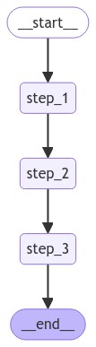

[](https://colab.research.google.com/github/langchain-ai/langchain-academy/blob/main/module-3/dynamic-breakpoints.ipynb) [](https://academy.langchain.com/courses/take/intro-to-langgraph/lessons/58239526-lesson-4-dynamic-breakpoints)

[](https://colab.research.google.com/github/langchain-ai/langchain-academy/blob/main/module-3/dynamic-breakpoints.ipynb) [](https://academy.langchain.com/courses/take/intro-to-langgraph/lessons/58239526-lesson-4-dynamic-breakpoints)


# Dynamic breakpoints  动态断点

## Review 复习

We discussed motivations for human-in-the-loop:

我们讨论了引入人工干预（human-in-the-loop）的动机：

(1) `Approval` - We can interrupt our agent, surface state to a user, and allow the user to accept an action

（1）`审批（Approval）`——我们可以中断代理执行，将当前状态呈现给用户，并允许用户接受某项操作

(2) `Debugging` - We can rewind the graph to reproduce or avoid issues

（2）`调试（Debugging）`——我们可以倒回图以复现或规避问题

(3) `Editing` - You can modify the state

（3）`编辑（Editing）`——您可以修改图的状态

We covered breakpoints as a general way to stop the graph at specific steps, which enables use-cases like `Approval`

我们介绍了断点作为一种通用机制，用于在特定步骤处停止图的执行，从而支持 `审批` 等用例

We also showed how to edit graph state, and introduce human feedback.

我们还展示了如何编辑图状态并引入人工反馈。

## Goals 目标

Breakpoints are set by the developer on a specific node during graph compilation.

断点由开发者在图编译期间针对特定节点设置。

But, sometimes it is helpful to allow the graph **dynamically interrupt** itself!

但有时，允许图**动态中断自身**会很有帮助！

This is an internal breakpoint, and can be achieved using `NodeInterrupt`.

这是一种内部断点，可通过 `NodeInterrupt` 实现。

This has a few specific benefits:

这具有若干特定优势：

(1) You can do it conditionally (from inside a node based on developer-defined logic).

（1）您可以有条件地触发中断（即在节点内部、基于开发者定义的逻辑）

(2) You can communicate to the user why it's interrupted (by passing whatever you want to the `NodeInterrupt`).

（2）您可以向用户说明中断原因（通过向 `NodeInterrupt` 传入任意所需信息）

Let's create a graph where a `NodeInterrupt` is thrown based on the length of the input.

让我们构建一个图，使其根据输入长度触发 `NodeInterrupt`。


```python
%%capture --no-stderr
%pip install --quiet -U langgraph langchain_openai langgraph_sdk
```


```python
from IPython.display import Image, display

from typing_extensions import TypedDict
from langgraph.checkpoint.memory import MemorySaver
from langgraph.errors import NodeInterrupt
from langgraph.graph import START, END, StateGraph

class State(TypedDict):
    input: str

def step_1(state: State) -> State:
    print("---Step 1---")
    return state

def step_2(state: State) -> State:
    # Let's optionally raise a NodeInterrupt if the length of the input is longer than 5 characters
    if len(state['input']) > 5:
        raise NodeInterrupt(f"Received input that is longer than 5 characters: {state['input']}")
    
    print("---Step 2---")
    return state

def step_3(state: State) -> State:
    print("---Step 3---")
    return state

builder = StateGraph(State)
builder.add_node("step_1", step_1)
builder.add_node("step_2", step_2)
builder.add_node("step_3", step_3)
builder.add_edge(START, "step_1")
builder.add_edge("step_1", "step_2")
builder.add_edge("step_2", "step_3")
builder.add_edge("step_3", END)

# Set up memory
memory = MemorySaver()

# Compile the graph with memory
graph = builder.compile(checkpointer=memory)

# View
display(Image(graph.get_graph().draw_mermaid_png()))
```


    

    


Let's run the graph with an input that's longer than 5 characters.

让我们使用一个长度超过 5 个字符的输入来运行该图。


```python
initial_input = {"input": "hello world"}
thread_config = {"configurable": {"thread_id": "1"}}

# Run the graph until the first interruption
for event in graph.stream(initial_input, thread_config, stream_mode="values"):
    print(event)
```

    {'input': 'hello world'}
    ---Step 1---
    {'input': 'hello world'}


If we inspect the graph state at this point, we the node set to execute next (`step_2`).

此时若检查图状态，可见下一个待执行节点为 `step_2`。


```python
state = graph.get_state(thread_config)
print(state.next)
```

    ('step_2',)


We can see that the `Interrupt` is logged to state.

我们可以看到 `Interrupt` 已被记录到状态中。


```python
print(state.tasks)
```

    (PregelTask(id='6eb3910d-e231-5ba2-b25e-28ad575690bd', name='step_2', error=None, interrupts=(Interrupt(value='Received input that is longer than 5 characters: hello world', when='during'),), state=None),)


We can try to resume the graph from the breakpoint.

我们可以尝试从该断点恢复图的执行。

But, this just re-runs the same node!

但这样只会重新运行同一个节点！

Unless state is changed we will be stuck here.

除非状态被修改，否则我们将一直卡在此处。


```python
for event in graph.stream(None, thread_config, stream_mode="values"):
    print(event)
```

    {'input': 'hello world'}


```python
state = graph.get_state(thread_config)
print(state.next)
```

    ('step_2',)


Now, we can update state.

现在，我们可以更新状态。


```python
graph.update_state(
    thread_config,
    {"input": "hi"},
)
```


    {'configurable': {'thread_id': '1',
      'checkpoint_ns': '',
      'checkpoint_id': '1ef6a434-06cf-6f1e-8002-0ea6dc69e075'}}


```python
for event in graph.stream(None, thread_config, stream_mode="values"):
    print(event)
```

    {'input': 'hi'}
    ---Step 2---
    {'input': 'hi'}
    ---Step 3---
    {'input': 'hi'}


### Usage with LangGraph API 与 LangGraph API 配合使用的注意事项

**⚠️ Notice**

⚠️ 注意

Since filming these videos, we've updated Studio so that it can now be run locally and accessed through your browser.

自录制这些视频以来，我们已更新 Studio，使其现在可本地运行并通过浏览器访问。

This is the preferred way to run Studio instead of using the Desktop App shown in the video.

这是运行 Studio 的首选方式，而非视频中展示的桌面应用。

It is now called _LangSmith Studio_ instead of _LangGraph Studio_.

它现在被称为 _LangSmith Studio_，而非 _LangGraph Studio_。

Detailed setup instructions are available in the "Getting Setup" guide at the start of the course.

详细的安装说明请参阅本课程开头的“环境准备”指南。

You can find a description of Studio [here](https://docs.langchain.com/langsmith/studio), and specific details for local deployment [here](https://docs.langchain.com/langsmith/quick-start-studio#local-development-server).

您可在此处查看 Studio 的介绍文档：[链接](https://docs.langchain.com/langsmith/studio)，以及本地部署的具体细节：[链接](https://docs.langchain.com/langsmith/quick-start-studio#local-development-server)。

To start the local development server, run the following command in your terminal in the `/studio` directory in this module:

要在本地启动开发服务器，请在本模块的 `/studio` 目录下于终端中运行以下命令：

```
langgraph dev
```

You should see the following output:

您应看到如下输出：

```
- 🚀 API: http://127.0.0.1:2024
- 🎨 Studio UI: https://smith.langchain.com/studio/?baseUrl=http://127.0.0.1:2024
- 📚 API Docs: http://127.0.0.1:2024/docs
```

Open your browser and navigate to the **Studio UI** URL shown above.

打开浏览器并导航至上方显示的 **Studio UI** URL。


```python
if 'google.colab' in str(get_ipython()):
    raise Exception("Unfortunately LangGraph Studio is currently not supported on Google Colab")
```

We connect to it via the SDK.

我们通过 SDK 连接到它。


```python
from langgraph_sdk import get_client

# This is the URL of the local development server
URL = "http://127.0.0.1:2024"
client = get_client(url=URL)

# Search all hosted graphs
assistants = await client.assistants.search()
```


```python
thread = await client.threads.create()
input_dict = {"input": "hello world"}

async for chunk in client.runs.stream(
    thread["thread_id"],
    assistant_id="dynamic_breakpoints",
    input=input_dict,
    stream_mode="values",):
    
    print(f"Receiving new event of type: {chunk.event}...")
    print(chunk.data)
    print("\n\n")
```

    Receiving new event of type: metadata...
    {'run_id': '1ef6a43a-1b04-64d0-9a79-1caff72c8a89'}
    
    
    
    Receiving new event of type: values...
    {'input': 'hello world'}
    
    
    
    Receiving new event of type: values...
    {'input': 'hello world'}
    
    
    


```python
current_state = await client.threads.get_state(thread['thread_id'])
```


```python
current_state['next']
```


    ['step_2']


```python
await client.threads.update_state(thread['thread_id'], {"input": "hi!"})
```


    {'configurable': {'thread_id': 'ea8c2912-987e-49d9-b890-6e81d46065f9',
      'checkpoint_ns': '',
      'checkpoint_id': '1ef6a43a-64b2-6e85-8002-3cf4f2873968'},
     'checkpoint_id': '1ef6a43a-64b2-6e85-8002-3cf4f2873968'}


```python
async for chunk in client.runs.stream(
    thread["thread_id"],
    assistant_id="dynamic_breakpoints",
    input=None,
    stream_mode="values",):
    
    print(f"Receiving new event of type: {chunk.event}...")
    print(chunk.data)
    print("\n\n")
```

    Receiving new event of type: metadata...
    {'run_id': '1ef64c33-fb34-6eaf-8b59-1d85c5b8acc9'}
    
    
    
    Receiving new event of type: values...
    {'input': 'hi!'}
    
    
    
    Receiving new event of type: values...
    {'input': 'hi!'}
    
    
    


```python
current_state = await client.threads.get_state(thread['thread_id'])
current_state
```


    {'values': {'input': 'hi!'},
     'next': ['step_2'],
     'tasks': [{'id': '858e41b2-6501-585c-9bca-55c1e729ef91',
       'name': 'step_2',
       'error': None,
       'interrupts': [],
       'state': None}],
     'metadata': {'step': 2,
      'source': 'update',
      'writes': {'step_1': {'input': 'hi!'}},
      'parents': {},
      'graph_id': 'dynamic_breakpoints'},
     'created_at': '2024-09-03T22:27:05.707260+00:00',
     'checkpoint_id': '1ef6a43a-64b2-6e85-8002-3cf4f2873968',
     'parent_checkpoint_id': '1ef6a43a-1cb8-6c3d-8001-7b11d0d34f00'}


```python

```
