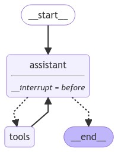
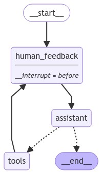

[](https://colab.research.google.com/github/langchain-ai/langchain-academy/blob/main/module-3/edit-state-human-feedback.ipynb) [](https://academy.langchain.com/courses/take/intro-to-langgraph/lessons/58239520-lesson-3-editing-state-and-human-feedback)

[](https://colab.research.google.com/github/langchain-ai/langchain-academy/blob/main/module-3/edit-state-human-feedback.ipynb) [](https://academy.langchain.com/courses/take/intro-to-langgraph/lessons/58239520-lesson-3-editing-state-and-human-feedback)


# Editing graph state 编辑图状态

## Review 回顾

We discussed motivations for human-in-the-loop:

我们讨论了引入人工闭环（human-in-the-loop）的动因：

(1) `Approval` - We can interrupt our agent, surface state to a user, and allow the user to accept an action

（1）`审批` — 我们可以中断代理、向用户展示当前状态，并允许用户接受某项操作

(2) `Debugging` - We can rewind the graph to reproduce or avoid issues

（2）`调试` — 我们可以倒回图以复现或规避问题

(3) `Editing` - You can modify the state

（3）`编辑` — 您可以修改状态

We showed how breakpoints support user approval, but don't yet know how to modify our graph state once our graph is interrupted!

我们已演示断点如何支持用户审批，但尚不清楚图被中断后如何修改图状态！

## Goals 目标

Now, let's show how to directly edit the graph state and insert human feedback.

现在，让我们演示如何直接编辑图状态并插入人工反馈。


```python
%%capture --no-stderr
%pip install --quiet -U langgraph langchain_openai langgraph_sdk langgraph-prebuilt
```


```python
import os, getpass

def _set_env(var: str):
    if not os.environ.get(var):
        os.environ[var] = getpass.getpass(f"{var}: ")

from dotenv import find_dotenv, load_dotenv

load_dotenv(find_dotenv(usecwd=True))
_set_env("OPENAI_API_KEY")
```

## Editing state  编辑状态

Previously, we introduced breakpoints.

此前，我们介绍了断点。

We used them to interrupt the graph and await user approval before executing the next node.

我们用它来中断图，并在执行下一个节点前等待用户审批。

But breakpoints are also [opportunities to modify the graph state](https://docs.langchain.com/oss/javascript/langgraph/use-time-travel#3-update-the-state).

但断点也是[修改图状态的机会](https://docs.langchain.com/oss/javascript/langgraph/use-time-travel#3-update-the-state)。

Let's set up our agent with a breakpoint before the `assistant` node.

让我们为代理在 `assistant` 节点前设置一个断点。


```python
import os
from langchain_openai import ChatOpenAI

def multiply(a: int, b: int) -> int:
    """Multiply a and b.

    Args:
        a: first int
        b: second int
    """
    return a * b

# This will be a tool
def add(a: int, b: int) -> int:
    """Adds a and b.

    Args:
        a: first int
        b: second int
    """
    return a + b

def divide(a: int, b: int) -> float:
    """Divide a by b.

    Args:
        a: first int
        b: second int
    """
    return a / b

tools = [add, multiply, divide]
llm = ChatOpenAI(model=os.getenv("OPENAI_MODEL", "qwen-plus"), base_url=os.getenv("OPENAI_BASE_URL", "https://dashscope.aliyuncs.com/compatible-mode/v1"))
llm_with_tools = llm.bind_tools(tools)
```


```python
from IPython.display import Image, display

from langgraph.checkpoint.memory import MemorySaver
from langgraph.graph import MessagesState
from langgraph.graph import START, StateGraph
from langgraph.prebuilt import tools_condition, ToolNode

from langchain_core.messages import HumanMessage, SystemMessage

# System message
sys_msg = SystemMessage(content="You are a helpful assistant tasked with performing arithmetic on a set of inputs.")

# Node
def assistant(state: MessagesState):
   return {"messages": [llm_with_tools.invoke([sys_msg] + state["messages"])]}

# Graph
builder = StateGraph(MessagesState)

# Define nodes: these do the work
builder.add_node("assistant", assistant)
builder.add_node("tools", ToolNode(tools))

# Define edges: these determine the control flow
builder.add_edge(START, "assistant")
builder.add_conditional_edges(
    "assistant",
    # If the latest message (result) from assistant is a tool call -> tools_condition routes to tools
    # If the latest message (result) from assistant is a not a tool call -> tools_condition routes to END
    tools_condition,
)
builder.add_edge("tools", "assistant")

memory = MemorySaver()
graph = builder.compile(interrupt_before=["assistant"], checkpointer=memory)

# Show
display(Image(graph.get_graph(xray=True).draw_mermaid_png()))
```


    

    


Let's run!

开始运行！

We can see the graph is interrupted before the chat model responds.

我们可以看到图在聊天模型响应前被中断了。


```python
# Input
initial_input = {"messages": "Multiply 2 and 3"}

# Thread
thread = {"configurable": {"thread_id": "1"}}

# Run the graph until the first interruption
for event in graph.stream(initial_input, thread, stream_mode="values"):
    event['messages'][-1].pretty_print()
```

    ================================ Human Message =================================
    
    Multiply 2 and 3


```python
state = graph.get_state(thread)
state
```


    StateSnapshot(values={'messages': [HumanMessage(content='Multiply 2 and 3', id='e7edcaba-bfed-4113-a85b-25cc39d6b5a7')]}, next=('assistant',), config={'configurable': {'thread_id': '1', 'checkpoint_ns': '', 'checkpoint_id': '1ef6a412-5b2d-601a-8000-4af760ea1d0d'}}, metadata={'source': 'loop', 'writes': None, 'step': 0, 'parents': {}}, created_at='2024-09-03T22:09:10.966883+00:00', parent_config={'configurable': {'thread_id': '1', 'checkpoint_ns': '', 'checkpoint_id': '1ef6a412-5b28-6ace-bfff-55d7a2c719ae'}}, tasks=(PregelTask(id='dbee122a-db69-51a7-b05b-a21fab160696', name='assistant', error=None, interrupts=(), state=None),))


Now, we can directly apply a state update.

现在，我们可以直接应用状态更新。

Remember, updates to the `messages` key will use the `add_messages` reducer:

请记住，对 `messages` 键的更新将使用 `add_messages` 归约器：

* If we want to over-write the existing message, we can supply the message `id`.
  - 如果我们想覆盖现有消息，可以提供该消息的 `id`。

* If we simply want to append to our list of messages, then we can pass a message without an `id` specified, as shown below.
  - 如果我们只想将消息追加到消息列表末尾，则可传入一个未指定 `id` 的消息（如下所示）。


```python
graph.update_state(
    thread,
    {"messages": [HumanMessage(content="No, actually multiply 3 and 3!")]},
)
```


    {'configurable': {'thread_id': '1',
      'checkpoint_ns': '',
      'checkpoint_id': '1ef6a414-f419-6182-8001-b9e899eca7e5'}}


Let's have a look.

我们来看一下。

We called `update_state` with a new message.

我们调用了 `update_state` 并传入一条新消息。

The `add_messages` reducer appends it to our state key, `messages`.

`add_messages` 归约器将其追加到我们的状态键 `messages` 中。


```python
new_state = graph.get_state(thread).values
for m in new_state['messages']:
    m.pretty_print()
```

    ================================ Human Message =================================
    
    Multiply 2 and 3
    ================================ Human Message =================================
    
    No, actually multiply 3 and 3!


Now, let's proceed with our agent, simply by passing `None` and allowing it proceed from the current state.

现在，我们只需传入 `None` 即可让代理从当前状态继续执行。

We emit the current and then proceed to execute the remaining nodes.

我们将先输出当前状态，然后继续执行剩余节点。


```python
for event in graph.stream(None, thread, stream_mode="values"):
    event['messages'][-1].pretty_print()
```

    ================================ Human Message =================================
    
    No, actually multiply 3 and 3!
    ================================== Ai Message ==================================
    Tool Calls:
      multiply (call_Mbu8MfA0krQh8rkZZALYiQMk)
     Call ID: call_Mbu8MfA0krQh8rkZZALYiQMk
      Args:
        a: 3
        b: 3
    ================================= Tool Message =================================
    Name: multiply
    
    9


Now, we're back at the `assistant`, which has our `breakpoint`.

现在，我们又回到了带有 `breakpoint` 的 `assistant` 节点。

We can again pass `None` to proceed.

我们可再次传入 `None` 以继续执行。


```python
for event in graph.stream(None, thread, stream_mode="values"):
    event['messages'][-1].pretty_print()
```

    ================================= Tool Message =================================
    Name: multiply
    
    9
    ================================== Ai Message ==================================
    
    3 multiplied by 3 equals 9.


### Editing graph state in Studio 在 Studio 中编辑图状态

**⚠️ Notice**

**⚠️ 注意**

Since filming these videos, we've updated Studio so that it can now be run locally and accessed through your browser.

自录制这些视频以来，我们已更新 Studio，使其现在可本地运行并通过浏览器访问。

This is the preferred way to run Studio instead of using the Desktop App shown in the video.

这是运行 Studio 的首选方式，而非视频中展示的桌面应用。

It is now called _LangSmith Studio_ instead of _LangGraph Studio_.

它现在被称为 _LangSmith Studio_，而非 _LangGraph Studio_。

Detailed setup instructions are available in the "Getting Setup" guide at the start of the course.

详细的安装说明可在本课程开头的“开始设置”指南中找到。

You can find a description of Studio [here](https://docs.langchain.com/langsmith/studio), and specific details for local deployment [here](https://docs.langchain.com/langsmith/quick-start-studio#local-development-server).

您可在此处查看 Studio 的说明文档：[此处](https://docs.langchain.com/langsmith/studio)，以及本地部署的具体细节：[此处](https://docs.langchain.com/langsmith/quick-start-studio#local-development-server)。

To start the local development server, run the following command in your terminal in the `/studio` directory in this module:

要在本地启动开发服务器，请在本模块的 `/studio` 目录下于终端中运行以下命令：

```
langgraph dev
```

You should see the following output:

您应看到如下输出：

```
- 🚀 API: http://127.0.0.1:2024
- 🎨 Studio UI: https://smith.langchain.com/studio/?baseUrl=http://127.0.0.1:2024
- 📚 API Docs: http://127.0.0.1:2024/docs
```

Open your browser and navigate to the **Studio UI** URL shown above.

打开您的浏览器并导航至上方显示的 **Studio UI** URL。

The LangGraph API [supports editing graph state](https://docs.langchain.com/langsmith/add-human-in-the-loop).

LangGraph API [支持编辑图状态](https://docs.langchain.com/langsmith/add-human-in-the-loop)。


```python
if 'google.colab' in str(get_ipython()):
    raise Exception("Unfortunately LangGraph Studio is currently not supported on Google Colab")
```


```python
# This is the URL of the local development server
from langgraph_sdk import get_client
client = get_client(url="http://127.0.0.1:2024")
```

Our agent is defined in `studio/agent.py`.

我们的代理定义在 `studio/agent.py` 中。

If you look at the code, you'll see that it *does not* have a breakpoint!

如果您查看代码，会发现其中 *并未* 设置断点！

Of course, we can add it to `agent.py`, but one very nice feature of the API is that we can pass in a breakpoint!

当然，我们可以在 `agent.py` 中添加断点，但 API 的一个非常实用的功能是：我们可以直接传入断点！

Here, we pass a `interrupt_before=["assistant"]`.

此处，我们传入 `interrupt_before=["assistant"]`。


```python
initial_input = {"messages": "Multiply 2 and 3"}
thread = await client.threads.create()
async for chunk in client.runs.stream(
    thread["thread_id"],
    "agent",
    input=initial_input,
    stream_mode="values",
    interrupt_before=["assistant"],
):
    print(f"Receiving new event of type: {chunk.event}...")
    messages = chunk.data.get('messages', [])
    if messages:
        print(messages[-1])
    print("-" * 50)
```

    Receiving new event of type: metadata...
    --------------------------------------------------
    Receiving new event of type: values...
    {'content': 'Multiply 2 and 3', 'additional_kwargs': {}, 'response_metadata': {}, 'type': 'human', 'name': None, 'id': '882dabe4-b877-4d71-bd09-c34cb97c4f46', 'example': False}
    --------------------------------------------------


We can get the current state

我们可以获取当前状态。


```python
current_state = await client.threads.get_state(thread['thread_id'])
current_state
```


    {'values': {'messages': [{'content': 'Multiply 2 and 3',
        'additional_kwargs': {},
        'response_metadata': {},
        'type': 'human',
        'name': None,
        'id': '882dabe4-b877-4d71-bd09-c34cb97c4f46',
        'example': False}]},
     'next': ['assistant'],
     'tasks': [{'id': 'a71c0b80-a679-57cb-aa59-a1655b763480',
       'name': 'assistant',
       'error': None,
       'interrupts': [],
       'state': None}],
     'metadata': {'step': 0,
      'run_id': '1ef6a41c-ea63-663f-b3e8-4f001bf0bf53',
      'source': 'loop',
      'writes': None,
      'parents': {},
      'user_id': '',
      'graph_id': 'agent',
      'thread_id': 'a95ffa54-2435-4a47-a9da-e886369ca8ee',
      'created_by': 'system',
      'assistant_id': 'fe096781-5601-53d2-b2f6-0d3403f7e9ca'},
     'created_at': '2024-09-03T22:13:54.466695+00:00',
     'checkpoint_id': '1ef6a41c-ead7-637b-8000-8c6a7b98379e',
     'parent_checkpoint_id': '1ef6a41c-ead3-637d-bfff-397ebdb4f2ea'}


We can look at the last message in state.

我们可以查看状态中的最后一条消息。


```python
last_message = current_state['values']['messages'][-1]
last_message
```


    {'content': 'Multiply 2 and 3',
     'additional_kwargs': {},
     'response_metadata': {},
     'type': 'human',
     'name': None,
     'id': '882dabe4-b877-4d71-bd09-c34cb97c4f46',
     'example': False}


We can edit it!

我们可以编辑它！


```python
last_message['content'] = "No, actually multiply 3 and 3!"
last_message
```


    {'content': 'No, actually multiply 3 and 3!',
     'additional_kwargs': {},
     'response_metadata': {},
     'type': 'human',
     'name': None,
     'id': '882dabe4-b877-4d71-bd09-c34cb97c4f46',
     'example': False}


```python
last_message
```


    {'content': 'No, actually multiply 3 and 3!',
     'additional_kwargs': {},
     'response_metadata': {},
     'type': 'human',
     'name': None,
     'id': '882dabe4-b877-4d71-bd09-c34cb97c4f46',
     'example': False}


Remember, as we said before, updates to the `messages` key will use the same `add_messages` reducer.

请记住，如前所述，对 `messages` 键的更新将使用相同的 `add_messages` 归约器。

If we want to over-write the existing message, then we can supply the message `id`.

如果我们想覆盖现有消息，则可以提供该消息的 `id`。

Here, we did that.

此处我们正是这样做的。

We only modified the message `content`, as shown above.

我们仅修改了消息的 `content`（如上所示）。


```python
await client.threads.update_state(thread['thread_id'], {"messages": last_message})
```


    {'configurable': {'thread_id': 'a95ffa54-2435-4a47-a9da-e886369ca8ee',
      'checkpoint_ns': '',
      'checkpoint_id': '1ef6a41d-cc8e-6979-8001-8c7c283b636c'},
     'checkpoint_id': '1ef6a41d-cc8e-6979-8001-8c7c283b636c'}


Now, we resume by passing `None`.

现在，我们通过传入 `None` 来恢复执行。


```python
async for chunk in client.runs.stream(
    thread["thread_id"],
    assistant_id="agent",
    input=None,
    stream_mode="values",
    interrupt_before=["assistant"],
):
    print(f"Receiving new event of type: {chunk.event}...")
    messages = chunk.data.get('messages', [])
    if messages:
        print(messages[-1])
    print("-" * 50)
```

    Receiving new event of type: metadata...
    --------------------------------------------------
    Receiving new event of type: values...
    {'content': 'No, actually multiply 3 and 3!', 'additional_kwargs': {'additional_kwargs': {}, 'response_metadata': {}, 'example': False}, 'response_metadata': {}, 'type': 'human', 'name': None, 'id': '882dabe4-b877-4d71-bd09-c34cb97c4f46', 'example': False}
    --------------------------------------------------
    Receiving new event of type: values...
    {'content': '', 'additional_kwargs': {'tool_calls': [{'index': 0, 'id': 'call_vi16je2EIikHuT7Aue2sd1qd', 'function': {'arguments': '{"a":3,"b":3}', 'name': 'multiply'}, 'type': 'function'}]}, 'response_metadata': {'finish_reason': 'tool_calls', 'model_name': 'gpt-4o-2024-05-13', 'system_fingerprint': 'fp_157b3831f5'}, 'type': 'ai', 'name': None, 'id': 'run-775b42f7-0590-4c54-aaeb-78599b1f12d2', 'example': False, 'tool_calls': [{'name': 'multiply', 'args': {'a': 3, 'b': 3}, 'id': 'call_vi16je2EIikHuT7Aue2sd1qd', 'type': 'tool_call'}], 'invalid_tool_calls': [], 'usage_metadata': None}
    --------------------------------------------------
    Receiving new event of type: values...
    {'content': '9', 'additional_kwargs': {}, 'response_metadata': {}, 'type': 'tool', 'name': 'multiply', 'id': '226bfbad-0cea-4900-80c5-761a62bd4bc1', 'tool_call_id': 'call_vi16je2EIikHuT7Aue2sd1qd', 'artifact': None, 'status': 'success'}
    --------------------------------------------------


We get the result of the tool call as `9`, as expected.

我们得到了工具调用的结果 `9`，符合预期。


```python
async for chunk in client.runs.stream(
    thread["thread_id"],
    assistant_id="agent",
    input=None,
    stream_mode="values",
    interrupt_before=["assistant"],
):
    print(f"Receiving new event of type: {chunk.event}...")
    messages = chunk.data.get('messages', [])
    if messages:
        print(messages[-1])
    print("-" * 50)
```

    Receiving new event of type: metadata...
    --------------------------------------------------
    Receiving new event of type: values...
    {'content': '9', 'additional_kwargs': {}, 'response_metadata': {}, 'type': 'tool', 'name': 'multiply', 'id': '226bfbad-0cea-4900-80c5-761a62bd4bc1', 'tool_call_id': 'call_vi16je2EIikHuT7Aue2sd1qd', 'artifact': None, 'status': 'success'}
    --------------------------------------------------
    Receiving new event of type: values...
    {'content': 'The result of multiplying 3 by 3 is 9.', 'additional_kwargs': {}, 'response_metadata': {'finish_reason': 'stop', 'model_name': 'gpt-4o-2024-05-13', 'system_fingerprint': 'fp_157b3831f5'}, 'type': 'ai', 'name': None, 'id': 'run-859bbf47-9f35-4e71-ae98-9d93ee49d16c', 'example': False, 'tool_calls': [], 'invalid_tool_calls': [], 'usage_metadata': None}
    --------------------------------------------------


## Awaiting user input 等待用户输入

So, it's clear that we can edit our agent state after a breakpoint.

因此，显然我们可以在断点之后编辑代理状态。

Now, what if we want to allow for human feedback to perform this state update?

那么，如果我们希望允许人工反馈来执行此状态更新，该怎么办？

We'll add a node that serves as a placeholder for human feedback within our agent.

我们将在代理中添加一个节点，作为人工反馈的占位符。

This `human_feedback` node allow the user to add feedback directly to state.

这个 `human_feedback` 节点允许用户直接向状态添加反馈。

We specify the breakpoint using `interrupt_before` our `human_feedback` node.

我们通过在 `human_feedback` 节点前设置 `interrupt_before` 来指定断点。

We set up a checkpointer to save the state of the graph up until this node.

我们设置一个检查点器（checkpointer），以保存图在此节点之前的状态。


```python
# System message
sys_msg = SystemMessage(content="You are a helpful assistant tasked with performing arithmetic on a set of inputs.")

# no-op node that should be interrupted on
def human_feedback(state: MessagesState):
    pass

# Assistant node
def assistant(state: MessagesState):
   return {"messages": [llm_with_tools.invoke([sys_msg] + state["messages"])]}

# Graph
builder = StateGraph(MessagesState)

# Define nodes: these do the work
builder.add_node("assistant", assistant)
builder.add_node("tools", ToolNode(tools))
builder.add_node("human_feedback", human_feedback)

# Define edges: these determine the control flow
builder.add_edge(START, "human_feedback")
builder.add_edge("human_feedback", "assistant")
builder.add_conditional_edges(
    "assistant",
    # If the latest message (result) from assistant is a tool call -> tools_condition routes to tools
    # If the latest message (result) from assistant is a not a tool call -> tools_condition routes to END
    tools_condition,
)
builder.add_edge("tools", "human_feedback")

memory = MemorySaver()
graph = builder.compile(interrupt_before=["human_feedback"], checkpointer=memory)
display(Image(graph.get_graph().draw_mermaid_png()))
```


    

    


We will get feedback from the user.

我们将从用户处获取反馈。

We use `.update_state` to update the state of the graph with the human response we get, as before.

我们像之前一样，使用 `.update_state` 来用获取到的人类响应更新图的状态。

We use the `as_node="human_feedback"` parameter to apply this state update as the specified node, `human_feedback`.

我们使用 `as_node="human_feedback"` 参数将此状态更新应用为指定节点 `human_feedback`。


```python
# Input
initial_input = {"messages": "Multiply 2 and 3"}

# Thread
thread = {"configurable": {"thread_id": "5"}}

# Run the graph until the first interruption
for event in graph.stream(initial_input, thread, stream_mode="values"):
    event["messages"][-1].pretty_print()
    
# Get user input
user_input = input("Tell me how you want to update the state: ")

# We now update the state as if we are the human_feedback node
graph.update_state(thread, {"messages": user_input}, as_node="human_feedback")

# Continue the graph execution
for event in graph.stream(None, thread, stream_mode="values"):
    event["messages"][-1].pretty_print()
```

    ================================ Human Message =================================
    
    Multiply 2 and 3
    ================================ Human Message =================================
    
    no, multiply 3 and 3
    ================================== Ai Message ==================================
    Tool Calls:
      multiply (call_sewrDyCrAJBQQecusUoT6OJ6)
     Call ID: call_sewrDyCrAJBQQecusUoT6OJ6
      Args:
        a: 3
        b: 3
    ================================= Tool Message =================================
    Name: multiply
    
    9


```python
# Continue the graph execution
for event in graph.stream(None, thread, stream_mode="values"):
    event["messages"][-1].pretty_print()
```

    ================================= Tool Message =================================
    Name: multiply
    
    9
    ================================== Ai Message ==================================
    
    The result of multiplying 3 and 3 is 9.

