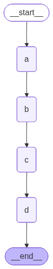
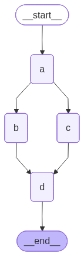
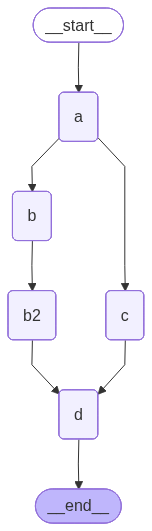
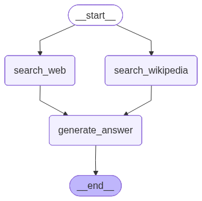

[](https://colab.research.google.com/github/langchain-ai/langchain-academy/blob/main/module-4/parallelization.ipynb) [](https://academy.langchain.com/courses/take/intro-to-langgraph/lessons/58239934-lesson-1-parallelization)

[](https://colab.research.google.com/github/langchain-ai/langchain-academy/blob/main/module-4/parallelization.ipynb) [](https://academy.langchain.com/courses/take/intro-to-langgraph/lessons/58239934-lesson-1-parallelization)


# Parallel node execution 并行节点执行

## Review 复习

In module 3, we went in-depth on `human-in-the loop`, showing 3 common use-cases:

在模块 3 中，我们深入探讨了 `human-in-the-loop`（人在环中），展示了三种常见用例：

(1) `Approval` - We can interrupt our agent, surface state to a user, and allow the user to accept an action

（1）`Approval`（审批）—— 我们可以中断代理、将状态呈现给用户，并允许用户接受某项操作

(2) `Debugging` - We can rewind the graph to reproduce or avoid issues

（2）`Debugging`（调试）—— 我们可以倒回图以复现或规避问题

(3) `Editing` - You can modify the state

（3）`Editing`（编辑）—— 您可以修改状态

## Goals 目标

This module will build on `human-in-the-loop` as well as the `memory` concepts discussed in module 2.

本模块将在模块 3 的 `human-in-the-loop` 基础上进一步延伸，并结合模块 2 中讨论的 `memory`（记忆）概念。

We will dive into `multi-agent` workflows and build up to a multi-agent research assistant that ties together all of the modules from this course.

我们将深入探讨 `multi-agent`（多代理）工作流，并最终构建一个整合本课程所有模块功能的多代理研究助手。

To build this multi-agent research assistant, we'll first discuss a few LangGraph controllability topics.

为构建该多代理研究助手，我们将首先讨论若干 LangGraph 可控性主题。

We'll start with [parallelization](https://docs.langchain.com/oss/python/langgraph/how-tos/graph-api#create-branches).

我们将从 [并行化](https://docs.langchain.com/oss/python/langgraph/how-tos/graph-api#create-branches) 开始。

## Fan out and fan in 扇出与扇入

Let's build a simple linear graph that over-writes the state at each step.

我们来构建一个简单的线性图，使其在每一步都覆写状态。


```python
%%capture --no-stderr
%pip install -U  langgraph langchain-tavily wikipedia langchain_openai langchain_community langgraph_sdk
```


```python
import os, getpass

def _set_env(var: str):
    if not os.environ.get(var):
        os.environ[var] = getpass.getpass(f"{var}: ")

from dotenv import find_dotenv, load_dotenv

load_dotenv(find_dotenv(usecwd=True))
_set_env("OPENAI_API_KEY")
```


```python
from IPython.display import Image, display

from typing import Any, List
from typing_extensions import TypedDict

from langgraph.graph import StateGraph, START, END

class State(TypedDict):
    # Note, no reducer function. 
    state: List[str]

class ReturnNodeValue:
    def __init__(self, node_secret: str):
        self._value = node_secret

    def __call__(self, state: State) -> Any:
        print(f"Adding {self._value} to {state['state']}")
        return {"state": [self._value]}

# Add nodes
builder = StateGraph(State)

# Initialize each node with node_secret 
builder.add_node("a", ReturnNodeValue("I'm A"))
builder.add_node("b", ReturnNodeValue("I'm B"))
builder.add_node("c", ReturnNodeValue("I'm C"))
builder.add_node("d", ReturnNodeValue("I'm D"))

# Flow
builder.add_edge(START, "a")
builder.add_edge("a", "b")
builder.add_edge("b", "c")
builder.add_edge("c", "d")
builder.add_edge("d", END)
graph = builder.compile()

display(Image(graph.get_graph().draw_mermaid_png()))
```


    

    


We over-write state, as expected.

如预期那样，我们覆写了状态。


```python
graph.invoke({"state": []})
```

    Adding I'm A to []
    Adding I'm B to ["I'm A"]
    Adding I'm C to ["I'm B"]
    Adding I'm D to ["I'm C"]


    {'state': ["I'm D"]}


Now, let's run `b` and `c` in parallel.

现在，让我们并行运行 `b` 和 `c`。

And then run `d`.

然后运行 `d`。

We can do this easily with fan-out from `a` to `b` and `c`, and then fan-in to `d`.

我们可以通过从 `a` 向 `b` 和 `c` 扇出、再向 `d` 扇入，轻松实现这一点。

The the state updates are applied at the end of each step.

状态更新会在每一步结束时应用。

Let's run it.

我们来运行它。


```python
builder = StateGraph(State)

# Initialize each node with node_secret 
builder.add_node("a", ReturnNodeValue("I'm A"))
builder.add_node("b", ReturnNodeValue("I'm B"))
builder.add_node("c", ReturnNodeValue("I'm C"))
builder.add_node("d", ReturnNodeValue("I'm D"))

# Flow
builder.add_edge(START, "a")
builder.add_edge("a", "b")
builder.add_edge("a", "c")
builder.add_edge("b", "d")
builder.add_edge("c", "d")
builder.add_edge("d", END)
graph = builder.compile()

display(Image(graph.get_graph().draw_mermaid_png()))
```


    

    


**We see an error**!

**我们看到一个错误！**

This is because both `b` and `c` are writing to the same state key / channel in the same step.

这是因为 `b` 和 `c` 在同一步骤中向同一状态键 / 通道写入数据。


```python
from langgraph.errors import InvalidUpdateError
try:
    graph.invoke({"state": []})
except InvalidUpdateError as e:
    print(f"An error occurred: {e}")
```

    Adding I'm A to []
    Adding I'm B to ["I'm A"]
    Adding I'm C to ["I'm A"]
    An error occurred: At key 'state': Can receive only one value per step. Use an Annotated key to handle multiple values.
    For troubleshooting, visit: https://python.langchain.com/docs/troubleshooting/errors/INVALID_CONCURRENT_GRAPH_UPDATE


When using fan out, we need to be sure that we are using a reducer if steps are writing to the same the channel / key.

使用扇出时，若多个步骤向同一通道 / 键写入数据，则必须确保使用归约器（reducer）。

As we touched on in Module 2, `operator.add` is a function from Python's built-in operator module.

正如我们在模块 2 中提到的，`operator.add` 是 Python 内置 operator 模块中的一个函数。

When `operator.add` is applied to lists, it performs list concatenation.

当 `operator.add` 应用于列表时，它执行的是列表拼接。


```python
import operator
from typing import Annotated

class State(TypedDict):
    # The operator.add reducer fn makes this append-only
    state: Annotated[list, operator.add]

# Add nodes
builder = StateGraph(State)

# Initialize each node with node_secret 
builder.add_node("a", ReturnNodeValue("I'm A"))
builder.add_node("b", ReturnNodeValue("I'm B"))
builder.add_node("c", ReturnNodeValue("I'm C"))
builder.add_node("d", ReturnNodeValue("I'm D"))

# Flow
builder.add_edge(START, "a")
builder.add_edge("a", "b")
builder.add_edge("a", "c")
builder.add_edge("b", "d")
builder.add_edge("c", "d")
builder.add_edge("d", END)
graph = builder.compile()

display(Image(graph.get_graph().draw_mermaid_png()))
```


    

    


```python
graph.invoke({"state": []})
```

    Adding I'm A to []
    Adding I'm C to ["I'm A"]
    Adding I'm B to ["I'm A"]
    Adding I'm D to ["I'm A", "I'm B", "I'm C"]


    {'state': ["I'm A", "I'm B", "I'm C", "I'm D"]}


Now we see that we append to state for the updates made in parallel by `b` and `c`.

现在我们看到，`b` 和 `c` 并行执行所作的状态更新被追加到了状态中。


## Waiting for nodes to finish 等待节点完成

Now, lets consider a case where one parallel path has more steps than the other one.

现在，我们考虑一种情况：一条并行路径的步骤数多于另一条。


```python
builder = StateGraph(State)

# Initialize each node with node_secret 
builder.add_node("a", ReturnNodeValue("I'm A"))
builder.add_node("b", ReturnNodeValue("I'm B"))
builder.add_node("b2", ReturnNodeValue("I'm B2"))
builder.add_node("c", ReturnNodeValue("I'm C"))
builder.add_node("d", ReturnNodeValue("I'm D"))

# Flow
builder.add_edge(START, "a")
builder.add_edge("a", "b")
builder.add_edge("a", "c")
builder.add_edge("b", "b2")
builder.add_edge(["b2", "c"], "d")
builder.add_edge("d", END)
graph = builder.compile()

display(Image(graph.get_graph().draw_mermaid_png()))
```


    

    


In this case, `b`, `b2`, and `c` are all part of the same step.

在此情况下，`b`、`b2` 和 `c` 都属于同一步骤。

The graph will wait for all of these to be completed before proceeding to step `d`.

图将在所有这些节点均完成之后，才进入步骤 `d`。


```python
graph.invoke({"state": []})
```

    Adding I'm A to []
    Adding I'm B to ["I'm A"]
    Adding I'm C to ["I'm A"]
    Adding I'm B2 to ["I'm A", "I'm B", "I'm C"]
    Adding I'm D to ["I'm A", "I'm B", "I'm C", "I'm B2"]


    {'state': ["I'm A", "I'm B", "I'm C", "I'm B2", "I'm D"]}


## Setting the order of state updates 设置状态更新顺序

However, within each step we don't have specific control over the order of the state updates!

然而，在每一步内部，我们无法精确控制状态更新的顺序！

In simple terms, it is a deterministic order determined by LangGraph based upon graph topology that **we do not control**.

简而言之，这是一种由 LangGraph 基于图拓扑结构确定的确定性顺序，**我们无法控制该顺序**。

Above, we see that `c` is added before `b2`.

上例中，我们看到 `c` 在 `b2` 之前被加入。

However, we can use a custom reducer to customize this e.g., sort state updates.

不过，我们可以使用自定义归约器来自定义此行为（例如对状态更新进行排序）。


```python
def sorting_reducer(left, right):
    """ Combines and sorts the values in a list"""
    if not isinstance(left, list):
        left = [left]

    if not isinstance(right, list):
        right = [right]
    
    return sorted(left + right, reverse=False)

class State(TypedDict):
    # sorting_reducer will sort the values in state
    state: Annotated[list, sorting_reducer]

# Add nodes
builder = StateGraph(State)

# Initialize each node with node_secret 
builder.add_node("a", ReturnNodeValue("I'm A"))
builder.add_node("b", ReturnNodeValue("I'm B"))
builder.add_node("b2", ReturnNodeValue("I'm B2"))
builder.add_node("c", ReturnNodeValue("I'm C"))
builder.add_node("d", ReturnNodeValue("I'm D"))

# Flow
builder.add_edge(START, "a")
builder.add_edge("a", "b")
builder.add_edge("a", "c")
builder.add_edge("b", "b2")
builder.add_edge(["b2", "c"], "d")
builder.add_edge("d", END)
graph = builder.compile()

display(Image(graph.get_graph().draw_mermaid_png()))
```


    

    


```python
graph.invoke({"state": []})
```

    Adding I'm A to []
    Adding I'm C to ["I'm A"]
    Adding I'm B to ["I'm A"]
    Adding I'm B2 to ["I'm A", "I'm B", "I'm C"]
    Adding I'm D to ["I'm A", "I'm B", "I'm B2", "I'm C"]


    {'state': ["I'm A", "I'm B", "I'm B2", "I'm C", "I'm D"]}


Now, the reducer sorts the updated state values!

现在，归约器会对更新后的状态值进行排序！

The `sorting_reducer` example sorts all values globally.

`sorting_reducer` 示例会对所有值进行全局排序。

We can also:

我们还可以：

1. Write outputs to a separate field in the state during the parallel step
  - 在并行步骤期间，将输出写入状态中的独立字段

2. Use a "sink" node after the parallel step to combine and order those outputs
  - 在并行步骤后使用一个“汇聚”（sink）节点，以合并并排序这些输出

3. Clear the temporary field after combining
  - 在合并后清空临时字段

<!-- See the [~docs~](https://langchain-ai.github.io/langgraph/how-tos/branching/#stable-sorting) [docs](https://docs.langchain.com/oss/python/langgraph/how-tos/graph-api#create-branches) for more details.-->


## Working with LLMs 与大语言模型（LLM）协同工作

Now, lets add a realistic example!

现在，我们添加一个更贴近实际的例子！

We want to gather context from two external sources (Wikipedia and Web-Search) and have an LLM answer a question.

我们希望从两个外部来源（维基百科和网络搜索）收集上下文，并让一个 LLM 回答问题。


```python
import os
from langchain_openai import ChatOpenAI
llm = ChatOpenAI(model=os.getenv("OPENAI_MODEL", "qwen-plus"), base_url=os.getenv("OPENAI_BASE_URL", "https://dashscope.aliyuncs.com/compatible-mode/v1"), temperature=0) 
```


```python
class State(TypedDict):
    question: str
    answer: str
    context: Annotated[list, operator.add]
```

You can try different web search tools.

您可以尝试不同的网络搜索工具。

[Tavily](https://tavily.com/) is one nice option to consider, but ensure your `TAVILY_API_KEY` is set.

[Tavily](https://tavily.com/) 是一个不错的选择，但请确保已设置 `TAVILY_API_KEY`。


```python
import os, getpass
def _set_env(var: str):
    if not os.environ.get(var):
        os.environ[var] = getpass.getpass(f"{var}: ")
_set_env("TAVILY_API_KEY")
```


```python
from langchain_core.messages import HumanMessage, SystemMessage

from langchain_community.document_loaders import WikipediaLoader
from langchain_tavily import TavilySearch  # updated since filming

def search_web(state):
    
    """ Retrieve docs from web search """

    # Search
    tavily_search = TavilySearch(max_results=3)
    data = tavily_search.invoke({"query": state['question']})
    search_docs = data.get("results", data)

     # Format
    formatted_search_docs = "\n\n---\n\n".join(
        [
            f'<Document href="{doc["url"]}">\n{doc["content"]}\n</Document>'
            for doc in search_docs
        ]
    )

    return {"context": [formatted_search_docs]} 

def search_wikipedia(state):
    
    """ Retrieve docs from wikipedia """

    # Search
    search_docs = WikipediaLoader(query=state['question'], 
                                  load_max_docs=2).load()

     # Format
    formatted_search_docs = "\n\n---\n\n".join(
        [
            f'<Document source="{doc.metadata["source"]}" page="{doc.metadata.get("page", "")}">\n{doc.page_content}\n</Document>'
            for doc in search_docs
        ]
    )

    return {"context": [formatted_search_docs]} 

def generate_answer(state):
    
    """ Node to answer a question """

    # Get state
    context = state["context"]
    question = state["question"]

    # Template
    answer_template = """Answer the question {question} using this context: {context}"""
    answer_instructions = answer_template.format(question=question, 
                                                       context=context)    
    
    # Answer
    answer = llm.invoke([SystemMessage(content=answer_instructions)]+[HumanMessage(content=f"Answer the question.")])
      
    # Append it to state
    return {"answer": answer}

# Add nodes
builder = StateGraph(State)

# Initialize each node with node_secret 
builder.add_node("search_web",search_web)
builder.add_node("search_wikipedia", search_wikipedia)
builder.add_node("generate_answer", generate_answer)

# Flow
builder.add_edge(START, "search_wikipedia")
builder.add_edge(START, "search_web")
builder.add_edge("search_wikipedia", "generate_answer")
builder.add_edge("search_web", "generate_answer")
builder.add_edge("generate_answer", END)
graph = builder.compile()

display(Image(graph.get_graph().draw_mermaid_png()))
```


    

    


```python
result = graph.invoke({"question": "How were Nvidia's Q2 2025 earnings"})
result['answer'].content
```


    "Nvidia's Q2 2025 earnings were strong, as the company reported an earnings per share (EPS) of $1.04, beating the forecast of $1.01, resulting in a 2.97% surprise. Revenue also exceeded expectations, with the company reporting $46.74 billion in revenue and adjusted earnings per share of $1.05, both surpassing analyst estimates. This performance drove a stock uptick, indicating positive market reception. However, there were concerns about the company's operations in China, which remains a question mark."


## Using with LangGraph API 使用 LangGraph API

**⚠️ Notice**

**⚠️ 注意**

Since filming these videos, we've updated Studio so that it can now be run locally and accessed through your browser.

自录制这些视频以来，我们已更新 Studio，使其现在可本地运行并通过浏览器访问。

This is the preferred way to run Studio instead of using the Desktop App shown in the video.

这是运行 Studio 的首选方式，而非视频中展示的桌面应用程序。

It is now called _LangSmith Studio_ instead of _LangGraph Studio_.

它现在被称为 _LangSmith Studio_，而非 _LangGraph Studio_。

Detailed setup instructions are available in the "Getting Setup" guide at the start of the course.

详细安装说明见本课程开头的“环境准备”指南。

You can find a description of Studio [here](https://docs.langchain.com/langsmith/studio), and specific details for local deployment [here](https://docs.langchain.com/langsmith/quick-start-studio#local-development-server).

您可在此处查阅 Studio 的介绍 [此处](https://docs.langchain.com/langsmith/studio)，以及本地部署的具体细节 [此处](https://docs.langchain.com/langsmith/quick-start-studio#local-development-server)。

To start the local development server, run the following command in your terminal in the `/studio` directory in this module:

要在本地启动开发服务器，请在本模块的 `/studio` 目录下于终端中运行以下命令：

```
langgraph dev
```

You should see the following output:

您应看到如下输出：

```
- 🚀 API: http://127.0.0.1:2024
- 🎨 Studio UI: https://smith.langchain.com/studio/?baseUrl=http://127.0.0.1:2024
- 📚 API Docs: http://127.0.0.1:2024/docs
```

Open your browser and navigate to the **Studio UI** URL shown above.

打开浏览器并导航至上方显示的 **Studio UI** URL。


```python
if 'google.colab' in str(get_ipython()):
    raise Exception("Unfortunately LangSmith Studio is currently not supported on Google Colab")
```


```python
from langgraph_sdk import get_client
client = get_client(url="http://127.0.0.1:2024")
```


```python
thread = await client.threads.create()
input_question = {"question": "How were Nvidia Q2 2025 earnings?"}
async for event in client.runs.stream(thread["thread_id"], 
                                      assistant_id="parallelization", 
                                      input=input_question, 
                                      stream_mode="values"):
    # Check if answer has been added to state  
    if event.data is not None:
        answer = event.data.get('answer', None)
        if answer:
            print(answer['content'])
```

    Nvidia's Q2 2025 earnings were strong, with the company reporting an earnings per share (EPS) of $1.04, beating the forecast of $1.01. Revenue also exceeded expectations, coming in at $46.7 billion, surpassing the previous quarter's record of $44.1 billion and besting economist forecasts of $46.05 billion. This resulted in a positive surprise and drove a stock uptick.


```python

```
