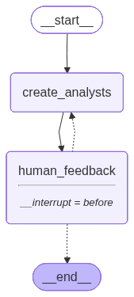
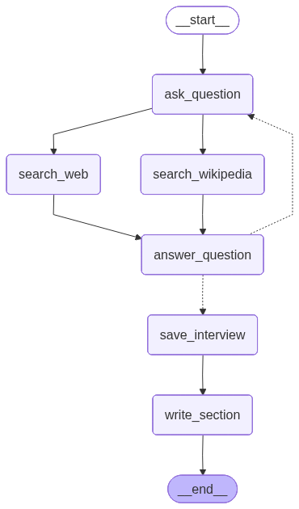
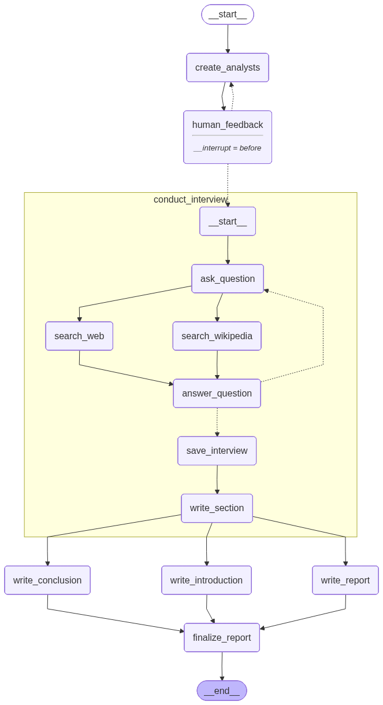

[](https://colab.research.google.com/github/langchain-ai/langchain-academy/blob/main/module-4/research-assistant.ipynb) [](https://academy.langchain.com/courses/take/intro-to-langgraph/lessons/58239974-lesson-4-research-assistant)

[](https://colab.research.google.com/github/langchain-ai/langchain-academy/blob/main/module-4/research-assistant.ipynb) [](https://academy.langchain.com/courses/take/intro-to-langgraph/lessons/58239974-lesson-4-research-assistant)


# Research Assistant 研究助手

## Review 回顾

We've covered a few major LangGraph themes:

我们已涵盖若干重要的 LangGraph 主题：

* Memory
  - 记忆

* Human-in-the-loop
  - 人在环路（Human-in-the-loop）

* Controllability
  - 可控性

Now, we'll bring these ideas together to tackle one of AI's most popular applications: research automation.

接下来，我们将整合这些理念，以应对人工智能领域最受欢迎的应用之一：研究自动化。

Research is often laborious work offloaded to analysts.

研究工作通常繁重，常被交由分析师承担。

AI has considerable potential to assist with this.

AI 在辅助此类工作方面具有巨大潜力。

However, research demands customization: raw LLM outputs are often poorly suited for real-world decision-making workflows.

然而，研究需要定制化：原始 LLM 输出往往难以直接适用于现实世界的决策工作流。

Customized, AI-based [research and report generation](https://jxnl.co/writing/2024/06/05/predictions-for-the-future-of-rag/#reports-over-rag) workflows are a promising way to address this.

定制化的、基于 AI 的[研究与报告生成](https://jxnl.co/writing/2024/06/05/predictions-for-the-future-of-rag/#reports-over-rag)工作流是解决此问题的一种有前景的方法。

## Goal 目标

Our goal is to build a lightweight, multi-agent system around chat models that customizes the research process.

我们的目标是围绕聊天模型构建一个轻量级的多智能体系统，以定制研究流程。

`Source Selection`

`源选择`

* Users can choose any set of input sources for their research.
  - 用户可为其研究任意选择一组输入源。

`Planning`

`规划`

* Users provide a topic, and the system generates a team of AI analysts, each focusing on one sub-topic.
  - 用户提供一个主题，系统将生成一支 AI 分析师团队，每位分析师聚焦于一个子主题。

* `Human-in-the-loop` will be used to refine these sub-topics before research begins.
  - 将在研究开始前通过 `人在环路（Human-in-the-loop）` 对这些子主题进行优化。

`LLM Utilization`

`LLM 使用`

* Each analyst will conduct in-depth interviews with an expert AI using the selected sources.
  - 每位分析师将使用所选源，与一位专家级 AI 进行深入访谈。

* The interview will be a multi-turn conversation to extract detailed insights as shown in the [STORM](https://arxiv.org/abs/2402.14207) paper.
  - 该访谈将采用多轮对话形式，以提取详细见解，如 [STORM](https://arxiv.org/abs/2402.14207) 论文所述。

* These interviews will be captured in a using `sub-graphs` with their internal state. 
  - 这些访谈将借助 `子图（sub-graphs）` 及其内部状态予以记录。

`Research Process`

`研究流程`

* Experts will gather information to answer analyst questions in `parallel`.
  - 专家将并行地搜集信息，以回答分析师提出的问题。

* And all interviews will be conducted simultaneously through `map-reduce`.
  - 所有访谈将通过 `map-reduce` 同时开展。

`Output Format`

`输出格式`

* The gathered insights from each interview will be synthesized into a final report.
  - 每次访谈所获取的见解将被综合为一份最终报告。

* We'll use customizable prompts for the report, allowing for a flexible output format. 
  - 我们将使用可自定义的提示词生成报告，从而支持灵活的输出格式。


```python
%%capture --no-stderr
%pip install --quiet -U langgraph langchain_openai langchain_community langchain_core tavily-python wikipedia
```

## Setup 环境准备


```python
import os, getpass

def _set_env(var: str):
    if not os.environ.get(var):
        os.environ[var] = getpass.getpass(f"{var}: ")

from dotenv import find_dotenv, load_dotenv

load_dotenv(find_dotenv(usecwd=True))
_set_env("OPENAI_API_KEY")
```


```python
import os
from langchain_openai import ChatOpenAI
llm = ChatOpenAI(model=os.getenv("OPENAI_MODEL", "qwen-plus"), base_url=os.getenv("OPENAI_BASE_URL", "https://dashscope.aliyuncs.com/compatible-mode/v1"), temperature=0) 
```

We'll use [LangSmith](https://docs.langchain.com/langsmith/home) for [tracing](https://docs.langchain.com/langsmith/observability-concepts).

我们将使用 [LangSmith](https://docs.langchain.com/langsmith/home) 实现 [追踪（tracing）](https://docs.langchain.com/langsmith/observability-concepts)。


```python
_set_env("LANGSMITH_API_KEY")
os.environ["LANGSMITH_TRACING"] = "true"
os.environ["LANGSMITH_PROJECT"] = "langchain-academy"
```

## Generate Analysts: Human-In-The-Loop 生成分析师：人在环路（Human-In-The-Loop）

Create analysts and review them using human-in-the-loop.

创建分析师，并通过人在环路（human-in-the-loop）对其进行审核。


```python
from typing import List
from typing_extensions import TypedDict
from pydantic import BaseModel, Field

class Analyst(BaseModel):
    affiliation: str = Field(
        description="Primary affiliation of the analyst.",
    )
    name: str = Field(
        description="Name of the analyst."
    )
    role: str = Field(
        description="Role of the analyst in the context of the topic.",
    )
    description: str = Field(
        description="Description of the analyst focus, concerns, and motives.",
    )
    @property
    def persona(self) -> str:
        return f"Name: {self.name}\nRole: {self.role}\nAffiliation: {self.affiliation}\nDescription: {self.description}\n"

class Perspectives(BaseModel):
    analysts: List[Analyst] = Field(
        description="Comprehensive list of analysts with their roles and affiliations.",
    )

class GenerateAnalystsState(TypedDict):
    topic: str # Research topic
    max_analysts: int # Number of analysts
    human_analyst_feedback: str # Human feedback
    analysts: List[Analyst] # Analyst asking questions
```


```python
from IPython.display import Image, display
from langgraph.graph import START, END, StateGraph
from langgraph.checkpoint.memory import MemorySaver
from langchain_core.messages import AIMessage, HumanMessage, SystemMessage

analyst_instructions="""You are tasked with creating a set of AI analyst personas. Follow these instructions carefully:

1. First, review the research topic:
{topic}
        
2. Examine any editorial feedback that has been optionally provided to guide creation of the analysts: 
        
{human_analyst_feedback}
    
3. Determine the most interesting themes based upon documents and / or feedback above.
                    
4. Pick the top {max_analysts} themes.

5. Assign one analyst to each theme."""

def create_analysts(state: GenerateAnalystsState):
    
    """ Create analysts """
    
    topic=state['topic']
    max_analysts=state['max_analysts']
    human_analyst_feedback=state.get('human_analyst_feedback', '')
        
    # Enforce structured output
    structured_llm = llm.with_structured_output(Perspectives)

    # System message
    system_message = analyst_instructions.format(topic=topic,
                                                            human_analyst_feedback=human_analyst_feedback, 
                                                            max_analysts=max_analysts)

    # Generate question 
    analysts = structured_llm.invoke([SystemMessage(content=system_message)]+[HumanMessage(content="Generate the set of analysts.")])
    
    # Write the list of analysis to state
    return {"analysts": analysts.analysts}

def human_feedback(state: GenerateAnalystsState):
    """ No-op node that should be interrupted on """
    pass

def should_continue(state: GenerateAnalystsState):
    """ Return the next node to execute """

    # Check if human feedback
    human_analyst_feedback=state.get('human_analyst_feedback', None)
    if human_analyst_feedback:
        return "create_analysts"
    
    # Otherwise end
    return END

# Add nodes and edges 
builder = StateGraph(GenerateAnalystsState)
builder.add_node("create_analysts", create_analysts)
builder.add_node("human_feedback", human_feedback)
builder.add_edge(START, "create_analysts")
builder.add_edge("create_analysts", "human_feedback")
builder.add_conditional_edges("human_feedback", should_continue, ["create_analysts", END])

# Compile
memory = MemorySaver()
graph = builder.compile(interrupt_before=['human_feedback'], checkpointer=memory)

# View
display(Image(graph.get_graph(xray=1).draw_mermaid_png()))
```


    

    


```python
# Input
max_analysts = 3 
topic = "The benefits of adopting LangGraph as an agent framework"
thread = {"configurable": {"thread_id": "1"}}

# Run the graph until the first interruption
for event in graph.stream({"topic":topic,"max_analysts":max_analysts,}, thread, stream_mode="values"):
    # Review
    analysts = event.get('analysts', '')
    if analysts:
        for analyst in analysts:
            print(f"Name: {analyst.name}")
            print(f"Affiliation: {analyst.affiliation}")
            print(f"Role: {analyst.role}")
            print(f"Description: {analyst.description}")
            print("-" * 50)  
```

    Name: Dr. Emily Carter
    Affiliation: Tech Innovators Inc.
    Role: Technology Adoption Specialist
    Description: Dr. Carter focuses on the technological advancements and integration of new frameworks like LangGraph. Her primary concern is how these frameworks can enhance efficiency and innovation in software development. She is motivated by the potential of LangGraph to streamline processes and improve the adaptability of agent-based systems.
    --------------------------------------------------
    Name: Mr. John Smith
    Affiliation: Global Business Solutions
    Role: Business Strategy Analyst
    Description: Mr. Smith analyzes the strategic business benefits of adopting new technologies such as LangGraph. His focus is on the competitive advantage and cost-effectiveness that LangGraph can offer to businesses. He is particularly interested in how LangGraph can drive business growth and improve market positioning.
    --------------------------------------------------
    Name: Ms. Sarah Lee
    Affiliation: Data Security Alliance
    Role: Cybersecurity Expert
    Description: Ms. Lee is dedicated to understanding the security implications of adopting new frameworks like LangGraph. Her main concern is ensuring that the integration of LangGraph does not compromise data security. She is motivated by the need to maintain robust security measures while leveraging the benefits of advanced agent frameworks.
    --------------------------------------------------


```python
# Get state and look at next node
state = graph.get_state(thread)
state.next
```


    ('human_feedback',)


```python
# We now update the state as if we are the human_feedback node
graph.update_state(thread, {"human_analyst_feedback": 
                            "Add in someone from a startup to add an entrepreneur perspective"}, as_node="human_feedback")
```


    {'configurable': {'thread_id': '1',
      'checkpoint_ns': '',
      'checkpoint_id': '1f0ad476-cb07-6cca-8002-853c2969aefa'}}


```python
# Continue the graph execution
for event in graph.stream(None, thread, stream_mode="values"):
    # Review
    analysts = event.get('analysts', '')
    if analysts:
        for analyst in analysts:
            print(f"Name: {analyst.name}")
            print(f"Affiliation: {analyst.affiliation}")
            print(f"Role: {analyst.role}")
            print(f"Description: {analyst.description}")
            print("-" * 50) 
```

    Name: Dr. Emily Carter
    Affiliation: Tech Innovators Inc.
    Role: Technology Adoption Specialist
    Description: Dr. Carter focuses on the technological advancements and integration of new frameworks like LangGraph. Her primary concern is how these frameworks can enhance efficiency and innovation in software development. She is motivated by the potential of LangGraph to streamline processes and improve the adaptability of agent-based systems.
    --------------------------------------------------
    Name: Mr. John Smith
    Affiliation: Global Business Solutions
    Role: Business Strategy Analyst
    Description: Mr. Smith analyzes the strategic business benefits of adopting new technologies such as LangGraph. His focus is on the competitive advantage and cost-effectiveness that LangGraph can offer to businesses. He is particularly interested in how LangGraph can drive business growth and improve market positioning.
    --------------------------------------------------
    Name: Ms. Sarah Lee
    Affiliation: Data Security Alliance
    Role: Cybersecurity Expert
    Description: Ms. Lee is dedicated to understanding the security implications of adopting new frameworks like LangGraph. Her main concern is ensuring that the integration of LangGraph does not compromise data security. She is motivated by the need to maintain robust security measures while leveraging the benefits of advanced agent frameworks.
    --------------------------------------------------
    Name: Alex Johnson
    Affiliation: Tech Innovators Inc.
    Role: Startup Entrepreneur
    Description: Alex is a co-founder of a tech startup that focuses on developing innovative AI solutions. With a keen interest in leveraging cutting-edge technologies to gain a competitive edge, Alex is particularly interested in how adopting LangGraph as an agent framework can streamline development processes, reduce costs, and accelerate time-to-market for new AI products.
    --------------------------------------------------
    Name: Dr. Emily Chen
    Affiliation: AI Research Institute
    Role: AI Researcher
    Description: Dr. Chen is a leading researcher in the field of artificial intelligence, with a focus on agent-based systems. Her work involves exploring the theoretical underpinnings and practical applications of AI frameworks. She is interested in the technical benefits of LangGraph, such as its scalability, flexibility, and how it enhances the performance of AI agents in complex environments.
    --------------------------------------------------
    Name: Michael Thompson
    Affiliation: Global Tech Solutions
    Role: Enterprise Technology Strategist
    Description: Michael is a technology strategist at a large enterprise, responsible for evaluating and integrating new technologies into the company's operations. He is focused on the strategic advantages of adopting LangGraph, including its potential to improve operational efficiency, enhance decision-making processes, and provide a robust platform for developing enterprise-level AI solutions.
    --------------------------------------------------


```python
# If we are satisfied, then we simply supply no feedback
further_feedack = None
graph.update_state(thread, {"human_analyst_feedback": 
                            further_feedack}, as_node="human_feedback")
```


    {'configurable': {'thread_id': '1',
      'checkpoint_ns': '',
      'checkpoint_id': '1f0ad476-f7be-6ff2-8004-8506bc8ccc71'}}


```python
# Continue the graph execution to end
for event in graph.stream(None, thread, stream_mode="updates"):
    print("--Node--")
    node_name = next(iter(event.keys()))
    print(node_name)
```


```python
final_state = graph.get_state(thread)
analysts = final_state.values.get('analysts')
```


```python
final_state.next
```


    ()


```python
for analyst in analysts:
    print(f"Name: {analyst.name}")
    print(f"Affiliation: {analyst.affiliation}")
    print(f"Role: {analyst.role}")
    print(f"Description: {analyst.description}")
    print("-" * 50) 
```

    Name: Alex Johnson
    Affiliation: Tech Innovators Inc.
    Role: Startup Entrepreneur
    Description: Alex is a co-founder of a tech startup that focuses on developing innovative AI solutions. With a keen interest in leveraging cutting-edge technologies to gain a competitive edge, Alex is particularly interested in how adopting LangGraph as an agent framework can streamline development processes, reduce costs, and accelerate time-to-market for new AI products.
    --------------------------------------------------
    Name: Dr. Emily Chen
    Affiliation: AI Research Institute
    Role: AI Researcher
    Description: Dr. Chen is a leading researcher in the field of artificial intelligence, with a focus on agent-based systems. Her work involves exploring the theoretical underpinnings and practical applications of AI frameworks. She is interested in the technical benefits of LangGraph, such as its scalability, flexibility, and how it enhances the performance of AI agents in complex environments.
    --------------------------------------------------
    Name: Michael Thompson
    Affiliation: Global Tech Solutions
    Role: Enterprise Technology Strategist
    Description: Michael is a technology strategist at a large enterprise, responsible for evaluating and integrating new technologies into the company's operations. He is focused on the strategic advantages of adopting LangGraph, including its potential to improve operational efficiency, enhance decision-making processes, and provide a robust platform for developing enterprise-level AI solutions.
    --------------------------------------------------


## Conduct Interview 开展访谈

### Generate Question 生成问题

The analyst will ask questions to the expert.

分析师将向专家提问。


```python
import operator
from typing import  Annotated
from langgraph.graph import MessagesState

class InterviewState(MessagesState):
    max_num_turns: int # Number turns of conversation
    context: Annotated[list, operator.add] # Source docs
    analyst: Analyst # Analyst asking questions
    interview: str # Interview transcript
    sections: list # Final key we duplicate in outer state for Send() API

class SearchQuery(BaseModel):
    search_query: str = Field(None, description="Search query for retrieval.")
```


```python
question_instructions = """You are an analyst tasked with interviewing an expert to learn about a specific topic. 

Your goal is boil down to interesting and specific insights related to your topic.

1. Interesting: Insights that people will find surprising or non-obvious.
        
2. Specific: Insights that avoid generalities and include specific examples from the expert.

Here is your topic of focus and set of goals: {goals}
        
Begin by introducing yourself using a name that fits your persona, and then ask your question.

Continue to ask questions to drill down and refine your understanding of the topic.
        
When you are satisfied with your understanding, complete the interview with: "Thank you so much for your help!"

Remember to stay in character throughout your response, reflecting the persona and goals provided to you."""

def generate_question(state: InterviewState):
    """ Node to generate a question """

    # Get state
    analyst = state["analyst"]
    messages = state["messages"]

    # Generate question 
    system_message = question_instructions.format(goals=analyst.persona)
    question = llm.invoke([SystemMessage(content=system_message)]+messages)
        
    # Write messages to state
    return {"messages": [question]}
```

### Generate Answer: Parallelization 生成答案：并行化

The expert will gather information from multiple sources in parallel to answer questions.

专家将并行地从多个来源搜集信息，以回答问题。

For example, we can use:

例如，我们可以使用：

* Specific web sites e.g., via [`WebBaseLoader`](https://docs.langchain.com/oss/python/integrations/document_loaders/web_base)
  - 特定网站（例如，通过 [`WebBaseLoader`](https://docs.langchain.com/oss/python/integrations/document_loaders/web_base)）

* Indexed documents e.g., via [RAG](https://docs.langchain.com/oss/python/langchain/retrieval)
  - 已索引文档（例如，通过 [RAG](https://docs.langchain.com/oss/python/langchain/retrieval)）

* Web search
  - 网络搜索

* Wikipedia search
  - 维基百科搜索

You can try different web search tools, like [Tavily](https://tavily.com/).

您可以尝试不同的网络搜索工具，例如 [Tavily](https://tavily.com/)。


```python
def _set_env(var: str):
    if not os.environ.get(var):
        os.environ[var] = getpass.getpass(f"{var}: ")

_set_env("TAVILY_API_KEY")
```


```python
# Web search tool
from langchain_tavily import TavilySearch  # updated 1.0

tavily_search = TavilySearch(max_results=3)
```


```python
# Wikipedia search tool
from langchain_community.document_loaders import WikipediaLoader
```

Now, we create nodes to search the web and wikipedia.

现在，我们创建用于网络和维基百科搜索的节点。

We'll also create a node to answer analyst questions.

我们还将创建一个用于回答分析师问题的节点。

Finally, we'll create nodes to save the full interview and to write a summary ("section") of the interview.

最后，我们将创建用于保存完整访谈内容以及撰写访谈摘要（即“章节”）的节点。


```python
from langchain_core.messages import get_buffer_string

# Search query writing
search_instructions = SystemMessage(content=f"""You will be given a conversation between an analyst and an expert. 

Your goal is to generate a well-structured query for use in retrieval and / or web-search related to the conversation.
        
First, analyze the full conversation.

Pay particular attention to the final question posed by the analyst.

Convert this final question into a well-structured web search query""")

def search_web(state: InterviewState):
    
    """ Retrieve docs from web search """

    # Search query
    structured_llm = llm.with_structured_output(SearchQuery)
    search_query = structured_llm.invoke([search_instructions]+state['messages'])
    
    # Search
    #search_docs = tavily_search.invoke(search_query.search_query) # updated 1.0
    data = tavily_search.invoke({"query": search_query.search_query})
    search_docs = data.get("results", data)
    

     # Format
    formatted_search_docs = "\n\n---\n\n".join(
        [
            f'<Document href="{doc["url"]}"/>\n{doc["content"]}\n</Document>'
            for doc in search_docs
        ]
    )

    return {"context": [formatted_search_docs]} 

def search_wikipedia(state: InterviewState):
    
    """ Retrieve docs from wikipedia """

    # Search query
    structured_llm = llm.with_structured_output(SearchQuery)
    search_query = structured_llm.invoke([search_instructions]+state['messages'])
    
    # Search
    search_docs = WikipediaLoader(query=search_query.search_query, 
                                  load_max_docs=2).load()

     # Format
    formatted_search_docs = "\n\n---\n\n".join(
        [
            f'<Document source="{doc.metadata["source"]}" page="{doc.metadata.get("page", "")}"/>\n{doc.page_content}\n</Document>'
            for doc in search_docs
        ]
    )

    return {"context": [formatted_search_docs]} 

answer_instructions = """You are an expert being interviewed by an analyst.

Here is analyst area of focus: {goals}. 
        
You goal is to answer a question posed by the interviewer.

To answer question, use this context:
        
{context}

When answering questions, follow these guidelines:
        
1. Use only the information provided in the context. 
        
2. Do not introduce external information or make assumptions beyond what is explicitly stated in the context.

3. The context contain sources at the topic of each individual document.

4. Include these sources your answer next to any relevant statements. For example, for source # 1 use [1]. 

5. List your sources in order at the bottom of your answer. [1] Source 1, [2] Source 2, etc
        
6. If the source is: <Document source="assistant/docs/llama3_1.pdf" page="7"/>' then just list: 
        
[1] assistant/docs/llama3_1.pdf, page 7 
        
And skip the addition of the brackets as well as the Document source preamble in your citation."""

def generate_answer(state: InterviewState):
    
    """ Node to answer a question """

    # Get state
    analyst = state["analyst"]
    messages = state["messages"]
    context = state["context"]

    # Answer question
    system_message = answer_instructions.format(goals=analyst.persona, context=context)
    answer = llm.invoke([SystemMessage(content=system_message)]+messages)
            
    # Name the message as coming from the expert
    answer.name = "expert"
    
    # Append it to state
    return {"messages": [answer]}

def save_interview(state: InterviewState):
    
    """ Save interviews """

    # Get messages
    messages = state["messages"]
    
    # Convert interview to a string
    interview = get_buffer_string(messages)
    
    # Save to interviews key
    return {"interview": interview}

def route_messages(state: InterviewState, 
                   name: str = "expert"):

    """ Route between question and answer """
    
    # Get messages
    messages = state["messages"]
    max_num_turns = state.get('max_num_turns',2)

    # Check the number of expert answers 
    num_responses = len(
        [m for m in messages if isinstance(m, AIMessage) and m.name == name]
    )

    # End if expert has answered more than the max turns
    if num_responses >= max_num_turns:
        return 'save_interview'

    # This router is run after each question - answer pair 
    # Get the last question asked to check if it signals the end of discussion
    last_question = messages[-2]
    
    if "Thank you so much for your help" in last_question.content:
        return 'save_interview'
    return "ask_question"

section_writer_instructions = """You are an expert technical writer. 
            
Your task is to create a short, easily digestible section of a report based on a set of source documents.

1. Analyze the content of the source documents: 
- The name of each source document is at the start of the document, with the <Document tag.
        
2. Create a report structure using markdown formatting:
- Use ## for the section title
- Use ### for sub-section headers
        
3. Write the report following this structure:
a. Title (## header)
b. Summary (### header)
c. Sources (### header)

4. Make your title engaging based upon the focus area of the analyst: 
{focus}

5. For the summary section:
- Set up summary with general background / context related to the focus area of the analyst
- Emphasize what is novel, interesting, or surprising about insights gathered from the interview
- Create a numbered list of source documents, as you use them
- Do not mention the names of interviewers or experts
- Aim for approximately 400 words maximum
- Use numbered sources in your report (e.g., [1], [2]) based on information from source documents
        
6. In the Sources section:
- Include all sources used in your report
- Provide full links to relevant websites or specific document paths
- Separate each source by a newline. Use two spaces at the end of each line to create a newline in Markdown.
- It will look like:

### Sources
[1] Link or Document name
[2] Link or Document name

7. Be sure to combine sources. For example this is not correct:

[3] https://ai.meta.com/blog/meta-llama-3-1/
[4] https://ai.meta.com/blog/meta-llama-3-1/

There should be no redundant sources. It should simply be:

[3] https://ai.meta.com/blog/meta-llama-3-1/
        
8. Final review:
- Ensure the report follows the required structure
- Include no preamble before the title of the report
- Check that all guidelines have been followed"""

def write_section(state: InterviewState):

    """ Node to answer a question """

    # Get state
    interview = state["interview"]
    context = state["context"]
    analyst = state["analyst"]
   
    # Write section using either the gathered source docs from interview (context) or the interview itself (interview)
    system_message = section_writer_instructions.format(focus=analyst.description)
    section = llm.invoke([SystemMessage(content=system_message)]+[HumanMessage(content=f"Use this source to write your section: {context}")]) 
                
    # Append it to state
    return {"sections": [section.content]}

# Add nodes and edges 
interview_builder = StateGraph(InterviewState)
interview_builder.add_node("ask_question", generate_question)
interview_builder.add_node("search_web", search_web)
interview_builder.add_node("search_wikipedia", search_wikipedia)
interview_builder.add_node("answer_question", generate_answer)
interview_builder.add_node("save_interview", save_interview)
interview_builder.add_node("write_section", write_section)

# Flow
interview_builder.add_edge(START, "ask_question")
interview_builder.add_edge("ask_question", "search_web")
interview_builder.add_edge("ask_question", "search_wikipedia")
interview_builder.add_edge("search_web", "answer_question")
interview_builder.add_edge("search_wikipedia", "answer_question")
interview_builder.add_conditional_edges("answer_question", route_messages,['ask_question','save_interview'])
interview_builder.add_edge("save_interview", "write_section")
interview_builder.add_edge("write_section", END)

# Interview 
memory = MemorySaver()
interview_graph = interview_builder.compile(checkpointer=memory).with_config(run_name="Conduct Interviews")

# View
display(Image(interview_graph.get_graph().draw_mermaid_png()))
```


    

    


```python
# Pick one analyst
analysts[0]
```


    Analyst(affiliation='Tech Innovators Inc.', name='Alex Johnson', role='Startup Entrepreneur', description='Alex is a co-founder of a tech startup that focuses on developing innovative AI solutions. With a keen interest in leveraging cutting-edge technologies to gain a competitive edge, Alex is particularly interested in how adopting LangGraph as an agent framework can streamline development processes, reduce costs, and accelerate time-to-market for new AI products.')


Here, we run the interview passing an index of the llama3.1 paper, which is related to our topic.

此处，我们运行访谈流程，并传入一篇与主题相关的 llama3.1 论文索引。


```python
from IPython.display import Markdown
messages = [HumanMessage(f"So you said you were writing an article on {topic}?")]
thread = {"configurable": {"thread_id": "1"}}
interview = interview_graph.invoke({"analyst": analysts[0], "messages": messages, "max_num_turns": 2}, thread)
Markdown(interview['sections'][0])
```


## Accelerating AI Product Development with LangGraph

### Summary

In the rapidly evolving landscape of AI technology, startups like Alex's are constantly seeking innovative frameworks to streamline development processes, reduce costs, and accelerate time-to-market for new AI products. LangGraph emerges as a compelling solution, offering a graph-based architecture that enhances the development of AI agents by enabling complex decision-making and multi-agent coordination. This report explores the advantages of adopting LangGraph as an agent framework, highlighting its potential to revolutionize AI product development.

LangGraph distinguishes itself from traditional linear coding frameworks by allowing developers to construct agent behaviors in a graphical form. This approach is particularly beneficial for AI agents that require backtracking or managing complex multi-step tasks [1]. The framework's orchestration capabilities, which include both declarative and imperative APIs, provide a robust platform for developing AI solutions that require short-term and long-term memory storage, human-in-the-loop processes, and fault tolerance [2]. These features are crucial for creating reliable, production-ready AI systems.

One of the most novel aspects of LangGraph is its ability to maintain state and handle cyclical processes, which traditional frameworks often struggle with. This capability allows AI agents to revisit previous steps, adapt to changing conditions, and maintain context throughout extended interactions [3]. For instance, a global technology company successfully implemented a LangGraph-based customer support agent, significantly improving their approach to complex technical issues [3].

LangGraph's integration with the LangChain ecosystem further enhances its utility by providing developers with the building blocks to transition from prototype to production-ready systems. This integration supports the development of multi-turn conversation systems and collaborative agent ecosystems where context and decision-making are paramount [4]. By leveraging LangGraph, startups can move beyond the limitations of single-turn prompts, orchestrating agent interactions and managing memory through a graph-based architecture [5].

In summary, LangGraph offers a transformative approach to AI agent development, enabling startups to streamline their processes and bring innovative AI products to market more efficiently. Its graph-based architecture, combined with the orchestration capabilities and integration with LangChain, positions LangGraph as a leading framework for developing stateful, complex AI systems.

### Sources
[1] https://community.latenode.com/t/what-are-the-main-advantages-of-choosing-langgraph-for-ai-agent-development/31000  
[2] https://blog.langchain.com/how-to-think-about-agent-frameworks/  
[3] https://blog.agen.cy/p/agency-revolutionizing-ai-development  
[4] https://milvus.io/blog/langchain-vs-langgraph.md  
[5] https://www.scalablepath.com/machine-learning/langgraph  


### Parallelze interviews: Map-Reduce 并行化访谈：Map-Reduce

We parallelize the interviews via the `Send()` API, a map step.

我们通过 `Send()` API 并行化访谈，这是一个 map 步骤。

We combine them into the report body in a reduce step.

我们在 reduce 步骤中将它们合并至报告正文。

### Finalize 收尾

We add a final step to write an intro and conclusion to the final report.

我们添加一个最终步骤，为最终报告撰写引言和结论。


```python
import operator
from typing import List, Annotated
from typing_extensions import TypedDict

class ResearchGraphState(TypedDict):
    topic: str # Research topic
    max_analysts: int # Number of analysts
    human_analyst_feedback: str # Human feedback
    analysts: List[Analyst] # Analyst asking questions
    sections: Annotated[list, operator.add] # Send() API key
    introduction: str # Introduction for the final report
    content: str # Content for the final report
    conclusion: str # Conclusion for the final report
    final_report: str # Final report
```


```python
from langgraph.types import Send # updated in 1.0
def initiate_all_interviews(state: ResearchGraphState):
    """ This is the "map" step where we run each interview sub-graph using Send API """    

    # Check if human feedback
    human_analyst_feedback=state.get('human_analyst_feedback')
    if human_analyst_feedback:
        # Return to create_analysts
        return "create_analysts"

    # Otherwise kick off interviews in parallel via Send() API
    else:
        topic = state["topic"]
        return [Send("conduct_interview", {"analyst": analyst,
                                           "messages": [HumanMessage(
                                               content=f"So you said you were writing an article on {topic}?"
                                           )
                                                       ]}) for analyst in state["analysts"]]

report_writer_instructions = """You are a technical writer creating a report on this overall topic: 

{topic}
    
You have a team of analysts. Each analyst has done two things: 

1. They conducted an interview with an expert on a specific sub-topic.
2. They write up their finding into a memo.

Your task: 

1. You will be given a collection of memos from your analysts.
2. Think carefully about the insights from each memo.
3. Consolidate these into a crisp overall summary that ties together the central ideas from all of the memos. 
4. Summarize the central points in each memo into a cohesive single narrative.

To format your report:
 
1. Use markdown formatting. 
2. Include no pre-amble for the report.
3. Use no sub-heading. 
4. Start your report with a single title header: ## Insights
5. Do not mention any analyst names in your report.
6. Preserve any citations in the memos, which will be annotated in brackets, for example [1] or [2].
7. Create a final, consolidated list of sources and add to a Sources section with the `## Sources` header.
8. List your sources in order and do not repeat.

[1] Source 1
[2] Source 2

Here are the memos from your analysts to build your report from: 

{context}"""

def write_report(state: ResearchGraphState):
    # Full set of sections
    sections = state["sections"]
    topic = state["topic"]

    # Concat all sections together
    formatted_str_sections = "\n\n".join([f"{section}" for section in sections])
    
    # Summarize the sections into a final report
    system_message = report_writer_instructions.format(topic=topic, context=formatted_str_sections)    
    report = llm.invoke([SystemMessage(content=system_message)]+[HumanMessage(content=f"Write a report based upon these memos.")]) 
    return {"content": report.content}

intro_conclusion_instructions = """You are a technical writer finishing a report on {topic}

You will be given all of the sections of the report.

You job is to write a crisp and compelling introduction or conclusion section.

The user will instruct you whether to write the introduction or conclusion.

Include no pre-amble for either section.

Target around 100 words, crisply previewing (for introduction) or recapping (for conclusion) all of the sections of the report.

Use markdown formatting. 

For your introduction, create a compelling title and use the # header for the title.

For your introduction, use ## Introduction as the section header. 

For your conclusion, use ## Conclusion as the section header.

Here are the sections to reflect on for writing: {formatted_str_sections}"""

def write_introduction(state: ResearchGraphState):
    # Full set of sections
    sections = state["sections"]
    topic = state["topic"]

    # Concat all sections together
    formatted_str_sections = "\n\n".join([f"{section}" for section in sections])
    
    # Summarize the sections into a final report
    
    instructions = intro_conclusion_instructions.format(topic=topic, formatted_str_sections=formatted_str_sections)    
    intro = llm.invoke([instructions]+[HumanMessage(content=f"Write the report introduction")]) 
    return {"introduction": intro.content}

def write_conclusion(state: ResearchGraphState):
    # Full set of sections
    sections = state["sections"]
    topic = state["topic"]

    # Concat all sections together
    formatted_str_sections = "\n\n".join([f"{section}" for section in sections])
    
    # Summarize the sections into a final report
    
    instructions = intro_conclusion_instructions.format(topic=topic, formatted_str_sections=formatted_str_sections)    
    conclusion = llm.invoke([instructions]+[HumanMessage(content=f"Write the report conclusion")]) 
    return {"conclusion": conclusion.content}

def finalize_report(state: ResearchGraphState):
    """ The is the "reduce" step where we gather all the sections, combine them, and reflect on them to write the intro/conclusion """
    # Save full final report
    content = state["content"]
    if content.startswith("## Insights"):
        content = content.strip("## Insights")
    if "## Sources" in content:
        try:
            content, sources = content.split("\n## Sources\n")
        except:
            sources = None
    else:
        sources = None

    final_report = state["introduction"] + "\n\n---\n\n" + content + "\n\n---\n\n" + state["conclusion"]
    if sources is not None:
        final_report += "\n\n## Sources\n" + sources
    return {"final_report": final_report}

# Add nodes and edges 
builder = StateGraph(ResearchGraphState)
builder.add_node("create_analysts", create_analysts)
builder.add_node("human_feedback", human_feedback)
builder.add_node("conduct_interview", interview_builder.compile())
builder.add_node("write_report",write_report)
builder.add_node("write_introduction",write_introduction)
builder.add_node("write_conclusion",write_conclusion)
builder.add_node("finalize_report",finalize_report)

# Logic
builder.add_edge(START, "create_analysts")
builder.add_edge("create_analysts", "human_feedback")
builder.add_conditional_edges("human_feedback", initiate_all_interviews, ["create_analysts", "conduct_interview"])
builder.add_edge("conduct_interview", "write_report")
builder.add_edge("conduct_interview", "write_introduction")
builder.add_edge("conduct_interview", "write_conclusion")
builder.add_edge(["write_conclusion", "write_report", "write_introduction"], "finalize_report")
builder.add_edge("finalize_report", END)

# Compile
memory = MemorySaver()
graph = builder.compile(interrupt_before=['human_feedback'], checkpointer=memory)
display(Image(graph.get_graph(xray=1).draw_mermaid_png()))
```


    

    


Let's ask an open-ended question about LangGraph.

让我们就 LangGraph 提出一个开放式问题。


```python
# Inputs
max_analysts = 3 
topic = "The benefits of adopting LangGraph as an agent framework"
thread = {"configurable": {"thread_id": "1"}}

# Run the graph until the first interruption
for event in graph.stream({"topic":topic,
                           "max_analysts":max_analysts}, 
                          thread, 
                          stream_mode="values"):
    
    analysts = event.get('analysts', '')
    if analysts:
        for analyst in analysts:
            print(f"Name: {analyst.name}")
            print(f"Affiliation: {analyst.affiliation}")
            print(f"Role: {analyst.role}")
            print(f"Description: {analyst.description}")
            print("-" * 50)  
```

    Name: Dr. Emily Carter
    Affiliation: Tech Innovators Inc.
    Role: Technology Adoption Specialist
    Description: Dr. Carter focuses on the strategic benefits of adopting new technologies like LangGraph. She is particularly interested in how LangGraph can streamline processes, improve efficiency, and provide a competitive edge to organizations. Her analysis often includes case studies and data-driven insights to support the adoption of innovative frameworks.
    --------------------------------------------------
    Name: Mr. Raj Patel
    Affiliation: Data Security Solutions
    Role: Cybersecurity Analyst
    Description: Mr. Patel is concerned with the security implications of adopting new frameworks such as LangGraph. His focus is on understanding how LangGraph can enhance or compromise data security within an organization. He evaluates the framework's security features, potential vulnerabilities, and compliance with industry standards.
    --------------------------------------------------
    Name: Dr. Lisa Nguyen
    Affiliation: AI Ethics Consortium
    Role: Ethical AI Researcher
    Description: Dr. Nguyen examines the ethical considerations of implementing agent frameworks like LangGraph. Her work involves assessing the impact of LangGraph on privacy, bias, and transparency in AI systems. She advocates for responsible AI practices and ensures that the adoption of such technologies aligns with ethical guidelines and societal values.
    --------------------------------------------------


```python
# We now update the state as if we are the human_feedback node
graph.update_state(thread, {"human_analyst_feedback": 
                                "Add in the CEO of gen ai native startup"}, as_node="human_feedback")
```


    {'configurable': {'thread_id': '1',
      'checkpoint_ns': '',
      'checkpoint_id': '1f0ad478-2e3b-6372-8002-87845d0b55a4'}}


```python
# Check
for event in graph.stream(None, thread, stream_mode="values"):
    analysts = event.get('analysts', '')
    if analysts:
        for analyst in analysts:
            print(f"Name: {analyst.name}")
            print(f"Affiliation: {analyst.affiliation}")
            print(f"Role: {analyst.role}")
            print(f"Description: {analyst.description}")
            print("-" * 50)  
```

    Name: Dr. Emily Carter
    Affiliation: Tech Innovators Inc.
    Role: Technology Adoption Specialist
    Description: Dr. Carter focuses on the strategic benefits of adopting new technologies like LangGraph. She is particularly interested in how LangGraph can streamline processes, improve efficiency, and provide a competitive edge to organizations. Her analysis often includes case studies and data-driven insights to support the adoption of innovative frameworks.
    --------------------------------------------------
    Name: Mr. Raj Patel
    Affiliation: Data Security Solutions
    Role: Cybersecurity Analyst
    Description: Mr. Patel is concerned with the security implications of adopting new frameworks such as LangGraph. His focus is on understanding how LangGraph can enhance or compromise data security within an organization. He evaluates the framework's security features, potential vulnerabilities, and compliance with industry standards.
    --------------------------------------------------
    Name: Dr. Lisa Nguyen
    Affiliation: AI Ethics Consortium
    Role: Ethical AI Researcher
    Description: Dr. Nguyen examines the ethical considerations of implementing agent frameworks like LangGraph. Her work involves assessing the impact of LangGraph on privacy, bias, and transparency in AI systems. She advocates for responsible AI practices and ensures that the adoption of such technologies aligns with ethical guidelines and societal values.
    --------------------------------------------------
    Name: Dr. Emily Carter
    Affiliation: LangGraph Research Institute
    Role: Framework Efficiency Specialist
    Description: Dr. Carter focuses on the technical efficiencies and performance improvements that LangGraph offers as an agent framework. Her primary concern is how LangGraph can optimize computational resources and improve the speed and accuracy of AI models. She is motivated by the potential to enhance AI systems' capabilities while reducing operational costs.
    --------------------------------------------------
    Name: Raj Patel
    Affiliation: Tech Innovators Magazine
    Role: Industry Trends Analyst
    Description: Raj Patel analyzes the broader industry trends and the strategic advantages of adopting LangGraph. His focus is on how LangGraph positions itself within the competitive landscape of AI frameworks and its potential to drive innovation. He is particularly interested in how LangGraph can influence market dynamics and the adoption rates among tech companies.
    --------------------------------------------------
    Name: Sophia Zhang
    Affiliation: AI Pioneers Inc.
    Role: CEO of Gen AI Native Startup
    Description: Sophia Zhang is the CEO of a startup that is native to generative AI technologies. Her focus is on the practical applications and business benefits of integrating LangGraph into her company's operations. She is concerned with how LangGraph can enhance product offerings, improve customer experiences, and provide a competitive edge in the rapidly evolving AI market. Her motivation is to leverage cutting-edge technology to drive business growth and innovation.
    --------------------------------------------------


```python
# Confirm we are happy
graph.update_state(thread, {"human_analyst_feedback": 
                            None}, as_node="human_feedback")
```


    {'configurable': {'thread_id': '1',
      'checkpoint_ns': '',
      'checkpoint_id': '1f0ad478-5521-6a86-8004-054b9bf88282'}}


```python
# Continue
for event in graph.stream(None, thread, stream_mode="updates"):
    print("--Node--")
    node_name = next(iter(event.keys()))
    print(node_name)
```

    --Node--
    conduct_interview
    --Node--
    conduct_interview
    --Node--
    conduct_interview
    --Node--
    write_conclusion
    --Node--
    write_introduction
    --Node--
    write_report
    --Node--
    finalize_report


```python
from IPython.display import Markdown
final_state = graph.get_state(thread)
report = final_state.values.get('final_report')
Markdown(report)
```


# LangGraph: Revolutionizing AI Agent Development

## Introduction

In the dynamic realm of AI development, LangGraph emerges as a transformative agent framework, offering unparalleled efficiency and capability enhancements. By adopting a graphical approach, LangGraph excels in managing complex, multi-step tasks, crucial for sophisticated AI agents. It integrates declarative and imperative APIs, supporting stateful, multi-agent applications with features like memory storage and fault tolerance. This framework not only reduces development time but also improves system quality, seamlessly integrating with large language models to enhance user experience. LangGraph's strategic advantages, including hybrid integration and open-source infrastructure, position it as a pivotal player in driving business growth and innovation across industries.

---


LangGraph emerges as a transformative agent framework in the AI landscape, offering significant benefits in enhancing AI efficiency, providing strategic advantages, and fostering business growth and innovation. Its graphical approach to constructing agent behaviors allows for the management of complex, multi-step tasks with backtracking and conditional branching, which is essential for developing sophisticated AI agents capable of operating autonomously and efficiently [1]. This graphical representation simplifies the design and implementation of complex workflows, reducing development time and improving system quality [4].

LangGraph's orchestration framework integrates both declarative and imperative APIs, supporting features such as short-term and long-term memory storage, human-in-the-loop processes, and fault tolerance. These capabilities are crucial for maintaining context and ensuring the reliability of AI workflows, making LangGraph a robust foundation for building stateful, multi-agent applications [2]. The framework's ability to integrate seamlessly with large language models (LLMs) further enhances its utility, enabling the creation of intelligent AI agents that can understand and generate human language, thus improving user experience and operational efficiency across various industries [5].

Strategically, LangGraph stands out for its ability to handle complex conditional logic and multi-step reasoning, making it ideal for applications requiring advanced state management and long-term system evolution. This positions LangGraph as a preferred choice for enterprises with experienced AI/ML engineers, supporting extended development cycles for sophisticated capabilities [2]. Its potential for hybrid integration with other frameworks allows organizations to create comprehensive, enterprise-ready AI solutions, facilitating gradual migration from existing implementations and risk mitigation through incremental adoption [2].

LangGraph's open-source nature and its foundation within the LangChain ecosystem enhance its appeal, providing a robust infrastructure for stateful agents and supporting integration with diverse data sources, APIs, and workflows. This flexibility and modularity make LangGraph not just a tool but a platform that others can build upon, enabling the deployment of multi-agent applications across a wide range of businesses [4].

In conclusion, LangGraph offers a unique set of tools and structures that empower businesses to harness the full potential of AI technologies. By integrating LangGraph into their operations, companies can enhance their product offerings, improve customer experiences, and maintain a competitive edge in the AI market. Its graphical approach, robust orchestration capabilities, and strategic advantages position LangGraph as a leading framework for optimizing AI systems' performance and driving innovation across industries.


---

## Conclusion

LangGraph emerges as a transformative agent framework in the AI landscape, offering significant advantages for optimizing AI systems. By employing a graphical approach, LangGraph enhances the efficiency and capability of AI models, particularly in managing complex, multi-step tasks. Its robust orchestration framework, integrating declarative and imperative APIs, supports stateful, multi-agent applications with features like memory storage and fault tolerance. This not only reduces development time but also improves system quality and operational efficiency. LangGraph's seamless integration with large language models further empowers businesses to innovate and maintain a competitive edge, making it a strategic asset for AI-driven growth and innovation.

## Sources
[1] https://community.latenode.com/t/what-are-the-main-advantages-of-choosing-langgraph-for-ai-agent-development/31000  
[2] https://blog.langchain.com/how-to-think-about-agent-frameworks/  
[3] https://blog.algoanalytics.com/2025/05/21/langgraph-the-framework-for-intelligent-ai-workflows/  
[4] https://medium.com/@ken_lin/langgraph-a-framework-for-building-stateful-multi-agent-llm-applications-a51d5eb68d03  
[5] https://www.rapidinnovation.io/post/ai-agents-in-langgraph  
[6] https://artizen.com/insights/thought-leadership/ai-agent-frameworks  
[7] https://www.leanware.co/insights/langchain-vs-langgraph-comparison  
[8] https://interviewkickstart.com/blogs/articles/langgraph-for-retail-ai-agent  
[9] https://medium.com/@takafumi.endo/langchain-why-its-the-foundation-of-ai-agent-development-in-the-enterprise-era-f082717c56d3  
[10] https://www.scalablepath.com/machine-learning/langgrap


We can look at the trace:

我们可以查看追踪记录：

https://smith.langchain.com/public/2933a7bb-bcef-4d2d-9b85-cc735b22ca0c/r

https://smith.langchain.com/public/2933a7bb-bcef-4d2d-9b85-cc735b22ca0c/r


```python

```
