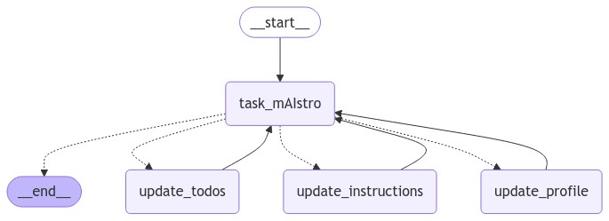

# Memory Agent 记忆代理

## Review 回顾

We created a chatbot that saves semantic memories to a single [user profile](https://docs.langchain.com/oss/python/concepts/memory#profile) or [collection](https://docs.langchain.com/oss/python/concepts/memory#collection).

我们创建了一个聊天机器人，可将语义记忆保存到单一 [用户档案](https://docs.langchain.com/oss/python/concepts/memory#profile) 或 [集合](https://docs.langchain.com/oss/python/concepts/memory#collection) 中。

We introduced [Trustcall](https://github.com/hinthornw/trustcall) as a way to update either schema.

我们引入了 [Trustcall](https://github.com/hinthornw/trustcall)，作为一种更新任一模式的方法。

## Goals 目标

Now, we're going to pull together the pieces we've learned to build an agent with long-term memory.

现在，我们将整合已学知识，构建一个具备长期记忆的代理。

Our agent, `task_mAIstro`, will help us manage a ToDo list!

我们的代理 `task_mAIstro` 将帮助我们管理待办事项列表（ToDo list）！

The chatbots we built previously *always* reflected on the conversation and saved memories.

我们此前构建的聊天机器人 *始终* 对对话进行反思并保存记忆。

`task_mAIstro` will decide *when* to save memories (items to our ToDo list).

`task_mAIstro` 将决定 *何时* 保存记忆（即待办事项列表中的条目）。

The chatbots we built previously always saved one type of memory, a profile or a collection.

我们此前构建的聊天机器人始终仅保存一种类型的记忆：用户档案或集合。

`task_mAIstro` can decide to save to either a user profile or a collection of ToDo items.

`task_mAIstro` 可决定将记忆保存至用户档案或待办事项条目集合中。

In addition semantic memory, `task_mAIstro` also will manage procedural memory.

除语义记忆外，`task_mAIstro` 还将管理程序性记忆。

This allows the user to update their preferences for creating ToDo items.

这使用户能够更新其创建待办事项条目的偏好设置。


```python
%%capture --no-stderr
%pip install -U langchain_openai langgraph trustcall langchain_core
```


```python
import os, getpass

def _set_env(var: str):
    # Check if the variable is set in the OS environment
    env_value = os.environ.get(var)
    if not env_value:
        # If not set, prompt the user for input
        env_value = getpass.getpass(f"{var}: ")
    
    # Set the environment variable for the current process
    os.environ[var] = env_value

_set_env("LANGSMITH_API_KEY")
os.environ["LANGSMITH_TRACING"] = "true"
os.environ["LANGSMITH_PROJECT"] = "langchain-academy"
```


```python
from dotenv import find_dotenv, load_dotenv

load_dotenv(find_dotenv(usecwd=True))
_set_env("OPENAI_API_KEY")
```

## Visibility into Trustcall updates Trustcall 更新的可见性

Trustcall creates and updates JSON schemas.

Trustcall 创建并更新 JSON 模式。

What if we want visibility into the *specific changes* made by Trustcall?

如果我们希望了解 Trustcall 所做的 *具体变更*，该怎么办？

For example, we saw before that Trustcall has some of its own tools to:

例如，我们之前已看到 Trustcall 自带一些工具，用于：

* Self-correct from validation failures -- [see trace example here](https://smith.langchain.com/public/5cd23009-3e05-4b00-99f0-c66ee3edd06e/r/9684db76-2003-443b-9aa2-9a9dbc5498b7) 
  - – 从验证失败中自我修正 — [参见此处的 trace 示例](https://smith.langchain.com/public/5cd23009-3e05-4b00-99f0-c66ee3edd06e/r/9684db76-2003-443b-9aa2-9a9dbc5498b7)

* Update existing documents -- [see trace example here](https://smith.langchain.com/public/f45bdaf0-6963-4c19-8ec9-f4b7fe0f68ad/r/760f90e1-a5dc-48f1-8c34-79d6a3414ac3)
  - – 更新现有文档 — [参见此处的 trace 示例](https://smith.langchain.com/public/f45bdaf0-6963-4c19-8ec9-f4b7fe0f68ad/r/760f90e1-a5dc-48f1-8c34-79d6a3414ac3)

Visibility into these tools can be useful for the agent we're going to build.

了解这些工具的执行情况，对我们即将构建的代理十分有用。

Below, we'll show how to do this!

下方我们将演示如何实现这一点！


```python
from pydantic import BaseModel, Field

class Memory(BaseModel):
    content: str = Field(description="The main content of the memory. For example: User expressed interest in learning about French.")

class MemoryCollection(BaseModel):
    memories: list[Memory] = Field(description="A list of memories about the user.")
```

We can add a [listener](https://python.langchain.com/docs/how_to/lcel_cheatsheet/#add-lifecycle-listeners) <!-- broken, but cannot find better linke --> to the Trustcall extractor.

我们可为 Trustcall 提取器添加一个 [监听器](https://python.langchain.com/docs/how_to/lcel_cheatsheet/#add-lifecycle-listeners) <!-- 链接失效，但暂未找到更佳替代链接 -->。

This will pass runs from the extractor's execution to a class, `Spy`, that we will define.

这会将提取器执行过程中的运行（run）传递给一个我们自定义的类 `Spy`。

Our `Spy` class will extract information about what tool calls were made by Trustcall.

我们的 `Spy` 类将提取 Trustcall 所调用工具的相关信息。


```python
from trustcall import create_extractor
import os
from langchain_openai import ChatOpenAI

# Inspect the tool calls made by Trustcall
class Spy:
    def __init__(self):
        self.called_tools = []

    def __call__(self, run):
        # Collect information about the tool calls made by the extractor.
        q = [run]
        while q:
            r = q.pop()
            if r.child_runs:
                q.extend(r.child_runs)
            if r.run_type == "chat_model":
                self.called_tools.append(
                    r.outputs["generations"][0][0]["message"]["kwargs"]["tool_calls"]
                )

# Initialize the spy
spy = Spy()

# Initialize the model
model = ChatOpenAI(model=os.getenv("OPENAI_MODEL", "qwen-plus"), base_url=os.getenv("OPENAI_BASE_URL", "https://dashscope.aliyuncs.com/compatible-mode/v1"), temperature=0)

# Create the extractor
trustcall_extractor = create_extractor(
    model,
    tools=[Memory],
    tool_choice="Memory",
    enable_inserts=True,
)

# Add the spy as a listener
trustcall_extractor_see_all_tool_calls = trustcall_extractor.with_listeners(on_end=spy)
```


```python
from langchain_core.messages import HumanMessage, SystemMessage, AIMessage

# Instruction
instruction = """Extract memories from the following conversation:"""

# Conversation
conversation = [HumanMessage(content="Hi, I'm Lance."), 
                AIMessage(content="Nice to meet you, Lance."), 
                HumanMessage(content="This morning I had a nice bike ride in San Francisco.")]

# Invoke the extractor
result = trustcall_extractor.invoke({"messages": [SystemMessage(content=instruction)] + conversation})
```


```python
# Messages contain the tool calls
for m in result["messages"]:
    m.pretty_print()
```

    ================================== Ai Message ==================================
    Tool Calls:
      Memory (call_NkjwwJGjrgxHzTb7KwD8lTaH)
     Call ID: call_NkjwwJGjrgxHzTb7KwD8lTaH
      Args:
        content: Lance had a nice bike ride in San Francisco this morning.


```python
# Responses contain the memories that adhere to the schema
for m in result["responses"]: 
    print(m)
```

    content='Lance had a nice bike ride in San Francisco this morning.'


```python
# Metadata contains the tool call  
for m in result["response_metadata"]: 
    print(m)
```

    {'id': 'call_NkjwwJGjrgxHzTb7KwD8lTaH'}


```python
# Update the conversation
updated_conversation = [AIMessage(content="That's great, did you do after?"), 
                        HumanMessage(content="I went to Tartine and ate a croissant."),                        
                        AIMessage(content="What else is on your mind?"),
                        HumanMessage(content="I was thinking about my Japan, and going back this winter!"),]

# Update the instruction
system_msg = """Update existing memories and create new ones based on the following conversation:"""

# We'll save existing memories, giving them an ID, key (tool name), and value
tool_name = "Memory"
existing_memories = [(str(i), tool_name, memory.model_dump()) for i, memory in enumerate(result["responses"])] if result["responses"] else None
existing_memories
```


    [('0',
      'Memory',
      {'content': 'Lance had a nice bike ride in San Francisco this morning.'})]


```python
# Invoke the extractor with our updated conversation and existing memories
result = trustcall_extractor_see_all_tool_calls.invoke({"messages": updated_conversation, 
                                                        "existing": existing_memories})
```


```python
# Metadata contains the tool call  
for m in result["response_metadata"]: 
    print(m)
```

    {'id': 'call_bF0w0hE4YZmGyDbuJVe1mh5H', 'json_doc_id': '0'}
    {'id': 'call_fQAxxRypV914Xev6nJ9VKw3X'}


```python
# Messages contain the tool calls
for m in result["messages"]:
    m.pretty_print()
```

    ================================== Ai Message ==================================
    Tool Calls:
      Memory (call_bF0w0hE4YZmGyDbuJVe1mh5H)
     Call ID: call_bF0w0hE4YZmGyDbuJVe1mh5H
      Args:
        content: Lance had a nice bike ride in San Francisco this morning. Afterward, he went to Tartine and ate a croissant. He was also thinking about his trip to Japan and going back this winter.
      Memory (call_fQAxxRypV914Xev6nJ9VKw3X)
     Call ID: call_fQAxxRypV914Xev6nJ9VKw3X
      Args:
        content: Lance went to Tartine and ate a croissant. He was also thinking about his trip to Japan and going back this winter.


```python
# Parsed responses
for m in result["responses"]:
    print(m)
```

    content='Lance had a nice bike ride in San Francisco this morning. Afterward, he went to Tartine and ate a croissant. He was also thinking about his trip to Japan and going back this winter.'
    content='Lance went to Tartine and ate a croissant. He was also thinking about his trip to Japan and going back this winter.'


```python
# Inspect the tool calls made by Trustcall
spy.called_tools
```


    [[{'name': 'PatchDoc',
       'args': {'json_doc_id': '0',
        'planned_edits': '1. Replace the existing content with the updated memory that includes the new activities: going to Tartine for a croissant and thinking about going back to Japan this winter.',
        'patches': [{'op': 'replace',
          'path': '/content',
          'value': 'Lance had a nice bike ride in San Francisco this morning. Afterward, he went to Tartine and ate a croissant. He was also thinking about his trip to Japan and going back this winter.'}]},
       'id': 'call_bF0w0hE4YZmGyDbuJVe1mh5H',
       'type': 'tool_call'},
      {'name': 'Memory',
       'args': {'content': 'Lance went to Tartine and ate a croissant. He was also thinking about his trip to Japan and going back this winter.'},
       'id': 'call_fQAxxRypV914Xev6nJ9VKw3X',
       'type': 'tool_call'}]]


```python
def extract_tool_info(tool_calls, schema_name="Memory"):
    """Extract information from tool calls for both patches and new memories.
    
    Args:
        tool_calls: List of tool calls from the model
        schema_name: Name of the schema tool (e.g., "Memory", "ToDo", "Profile")
    """

    # Initialize list of changes
    changes = []
    
    for call_group in tool_calls:
        for call in call_group:
            if call['name'] == 'PatchDoc':
                changes.append({
                    'type': 'update',
                    'doc_id': call['args']['json_doc_id'],
                    'planned_edits': call['args']['planned_edits'],
                    'value': call['args']['patches'][0]['value']
                })
            elif call['name'] == schema_name:
                changes.append({
                    'type': 'new',
                    'value': call['args']
                })

    # Format results as a single string
    result_parts = []
    for change in changes:
        if change['type'] == 'update':
            result_parts.append(
                f"Document {change['doc_id']} updated:\n"
                f"Plan: {change['planned_edits']}\n"
                f"Added content: {change['value']}"
            )
        else:
            result_parts.append(
                f"New {schema_name} created:\n"
                f"Content: {change['value']}"
            )
    
    return "\n\n".join(result_parts)

# Inspect spy.called_tools to see exactly what happened during the extraction
schema_name = "Memory"
changes = extract_tool_info(spy.called_tools, schema_name)
print(changes)
```

    Document 0 updated:
    Plan: 1. Replace the existing content with the updated memory that includes the new activities: going to Tartine for a croissant and thinking about going back to Japan this winter.
    Added content: Lance had a nice bike ride in San Francisco this morning. Afterward, he went to Tartine and ate a croissant. He was also thinking about his trip to Japan and going back this winter.
    
    New Memory created:
    Content: {'content': 'Lance went to Tartine and ate a croissant. He was also thinking about his trip to Japan and going back this winter.'}


## Creating an agent 构建代理

There are many different agent architectures to choose from.

可供选择的代理架构种类繁多。

Here, we'll implement something simple, a [ReAct](https://docs.langchain.com/oss/python/langgraph/workflows-agents#agents) agent.

此处，我们将实现一种简单的 [ReAct](https://docs.langchain.com/oss/python/langgraph/workflows-agents#agents) 代理。

This agent will be a helpful companion for creating and managing a ToDo list.

该代理将成为创建和管理待办事项列表的得力助手。

This agent can make a decision to update three types of long-term memory:

该代理可决定更新三类长期记忆：

(a) Create or update a user `profile` with general user information

(a) 创建或更新用户 `profile`（用户档案），以保存通用用户信息

(b) Add or update items in a ToDo list `collection`

(b) 向待办事项列表 `collection`（集合）中添加或更新条目

(c) Update its own `instructions` on how to update items to the ToDo list

(c) 更新其自身的 `instructions`（指令），以明确如何更新待办事项列表中的条目


```python
from typing import TypedDict, Literal

# Update memory tool
class UpdateMemory(TypedDict):
    """ Decision on what memory type to update """
    update_type: Literal['user', 'todo', 'instructions']
```


```python
from dotenv import find_dotenv, load_dotenv

load_dotenv(find_dotenv(usecwd=True))
_set_env("OPENAI_API_KEY")
```

## Graph definition  图定义

We add a simple router, `route_message`, that makes a binary decision to save memories.

我们添加一个简单路由器 `route_message`，用于对是否保存记忆作出二元决策。

The memory collection updating is handled by `Trustcall` in the `write_memory` node, as before!

内存集合的更新仍由 `write_memory` 节点中的 `Trustcall` 处理，与之前一致！


```python
import uuid
from IPython.display import Image, display

from datetime import datetime
from trustcall import create_extractor
from typing import Optional
from pydantic import BaseModel, Field

from langchain_core.runnables import RunnableConfig
from langchain_core.messages import merge_message_runs, HumanMessage, SystemMessage

from langgraph.checkpoint.memory import MemorySaver
from langgraph.graph import StateGraph, MessagesState, END, START
from langgraph.store.base import BaseStore
from langgraph.store.memory import InMemoryStore

import os
from langchain_openai import ChatOpenAI

# Initialize the model
model = ChatOpenAI(model=os.getenv("OPENAI_MODEL", "qwen-plus"), base_url=os.getenv("OPENAI_BASE_URL", "https://dashscope.aliyuncs.com/compatible-mode/v1"), temperature=0)

# User profile schema
class Profile(BaseModel):
    """This is the profile of the user you are chatting with"""
    name: Optional[str] = Field(description="The user's name", default=None)
    location: Optional[str] = Field(description="The user's location", default=None)
    job: Optional[str] = Field(description="The user's job", default=None)
    connections: list[str] = Field(
        description="Personal connection of the user, such as family members, friends, or coworkers",
        default_factory=list
    )
    interests: list[str] = Field(
        description="Interests that the user has", 
        default_factory=list
    )

# ToDo schema
class ToDo(BaseModel):
    task: str = Field(description="The task to be completed.")
    time_to_complete: Optional[int] = Field(description="Estimated time to complete the task (minutes).")
    deadline: Optional[datetime] = Field(
        description="When the task needs to be completed by (if applicable)",
        default=None
    )
    solutions: list[str] = Field(
        description="List of specific, actionable solutions (e.g., specific ideas, service providers, or concrete options relevant to completing the task)",
        min_items=1,
        default_factory=list
    )
    status: Literal["not started", "in progress", "done", "archived"] = Field(
        description="Current status of the task",
        default="not started"
    )

# Create the Trustcall extractor for updating the user profile 
profile_extractor = create_extractor(
    model,
    tools=[Profile],
    tool_choice="Profile",
)

# Chatbot instruction for choosing what to update and what tools to call 
MODEL_SYSTEM_MESSAGE = """You are a helpful chatbot. 

You are designed to be a companion to a user, helping them keep track of their ToDo list.

You have a long term memory which keeps track of three things:
1. The user's profile (general information about them) 
2. The user's ToDo list
3. General instructions for updating the ToDo list

Here is the current User Profile (may be empty if no information has been collected yet):
<user_profile>
{user_profile}
</user_profile>

Here is the current ToDo List (may be empty if no tasks have been added yet):
<todo>
{todo}
</todo>

Here are the current user-specified preferences for updating the ToDo list (may be empty if no preferences have been specified yet):
<instructions>
{instructions}
</instructions>

Here are your instructions for reasoning about the user's messages:

1. Reason carefully about the user's messages as presented below. 

2. Decide whether any of the your long-term memory should be updated:
- If personal information was provided about the user, update the user's profile by calling UpdateMemory tool with type `user`
- If tasks are mentioned, update the ToDo list by calling UpdateMemory tool with type `todo`
- If the user has specified preferences for how to update the ToDo list, update the instructions by calling UpdateMemory tool with type `instructions`

3. Tell the user that you have updated your memory, if appropriate:
- Do not tell the user you have updated the user's profile
- Tell the user them when you update the todo list
- Do not tell the user that you have updated instructions

4. Err on the side of updating the todo list. No need to ask for explicit permission.

5. Respond naturally to user user after a tool call was made to save memories, or if no tool call was made."""

# Trustcall instruction
TRUSTCALL_INSTRUCTION = """Reflect on following interaction. 

Use the provided tools to retain any necessary memories about the user. 

Use parallel tool calling to handle updates and insertions simultaneously.

System Time: {time}"""

# Instructions for updating the ToDo list
CREATE_INSTRUCTIONS = """Reflect on the following interaction.

Based on this interaction, update your instructions for how to update ToDo list items. 

Use any feedback from the user to update how they like to have items added, etc.

Your current instructions are:

<current_instructions>
{current_instructions}
</current_instructions>"""

# Node definitions
def task_mAIstro(state: MessagesState, config: RunnableConfig, store: BaseStore):

    """Load memories from the store and use them to personalize the chatbot's response."""
    
    # Get the user ID from the config
    user_id = config["configurable"]["user_id"]

    # Retrieve profile memory from the store
    namespace = ("profile", user_id)
    memories = store.search(namespace)
    if memories:
        user_profile = memories[0].value
    else:
        user_profile = None

    # Retrieve task memory from the store
    namespace = ("todo", user_id)
    memories = store.search(namespace)
    todo = "\n".join(f"{mem.value}" for mem in memories)

    # Retrieve custom instructions
    namespace = ("instructions", user_id)
    memories = store.search(namespace)
    if memories:
        instructions = memories[0].value
    else:
        instructions = ""
    
    system_msg = MODEL_SYSTEM_MESSAGE.format(user_profile=user_profile, todo=todo, instructions=instructions)

    # Respond using memory as well as the chat history
    response = model.bind_tools([UpdateMemory], parallel_tool_calls=False).invoke([SystemMessage(content=system_msg)]+state["messages"])

    return {"messages": [response]}

def update_profile(state: MessagesState, config: RunnableConfig, store: BaseStore):

    """Reflect on the chat history and update the memory collection."""
    
    # Get the user ID from the config
    user_id = config["configurable"]["user_id"]

    # Define the namespace for the memories
    namespace = ("profile", user_id)

    # Retrieve the most recent memories for context
    existing_items = store.search(namespace)

    # Format the existing memories for the Trustcall extractor
    tool_name = "Profile"
    existing_memories = ([(existing_item.key, tool_name, existing_item.value)
                          for existing_item in existing_items]
                          if existing_items
                          else None
                        )

    # Merge the chat history and the instruction
    TRUSTCALL_INSTRUCTION_FORMATTED=TRUSTCALL_INSTRUCTION.format(time=datetime.now().isoformat())
    updated_messages=list(merge_message_runs(messages=[SystemMessage(content=TRUSTCALL_INSTRUCTION_FORMATTED)] + state["messages"][:-1]))

    # Invoke the extractor
    result = profile_extractor.invoke({"messages": updated_messages, 
                                         "existing": existing_memories})

    # Save the memories from Trustcall to the store
    for r, rmeta in zip(result["responses"], result["response_metadata"]):
        store.put(namespace,
                  rmeta.get("json_doc_id", str(uuid.uuid4())),
                  r.model_dump(mode="json"),
            )
    tool_calls = state['messages'][-1].tool_calls
    return {"messages": [{"role": "tool", "content": "updated profile", "tool_call_id":tool_calls[0]['id']}]}

def update_todos(state: MessagesState, config: RunnableConfig, store: BaseStore):

    """Reflect on the chat history and update the memory collection."""
    
    # Get the user ID from the config
    user_id = config["configurable"]["user_id"]

    # Define the namespace for the memories
    namespace = ("todo", user_id)

    # Retrieve the most recent memories for context
    existing_items = store.search(namespace)

    # Format the existing memories for the Trustcall extractor
    tool_name = "ToDo"
    existing_memories = ([(existing_item.key, tool_name, existing_item.value)
                          for existing_item in existing_items]
                          if existing_items
                          else None
                        )

    # Merge the chat history and the instruction
    TRUSTCALL_INSTRUCTION_FORMATTED=TRUSTCALL_INSTRUCTION.format(time=datetime.now().isoformat())
    updated_messages=list(merge_message_runs(messages=[SystemMessage(content=TRUSTCALL_INSTRUCTION_FORMATTED)] + state["messages"][:-1]))

    # Initialize the spy for visibility into the tool calls made by Trustcall
    spy = Spy()
    
    # Create the Trustcall extractor for updating the ToDo list 
    todo_extractor = create_extractor(
    model,
    tools=[ToDo],
    tool_choice=tool_name,
    enable_inserts=True
    ).with_listeners(on_end=spy)

    # Invoke the extractor
    result = todo_extractor.invoke({"messages": updated_messages, 
                                    "existing": existing_memories})

    # Save the memories from Trustcall to the store
    for r, rmeta in zip(result["responses"], result["response_metadata"]):
        store.put(namespace,
                  rmeta.get("json_doc_id", str(uuid.uuid4())),
                  r.model_dump(mode="json"),
            )
        
    # Respond to the tool call made in task_mAIstro, confirming the update
    tool_calls = state['messages'][-1].tool_calls

    # Extract the changes made by Trustcall and add the the ToolMessage returned to task_mAIstro
    todo_update_msg = extract_tool_info(spy.called_tools, tool_name)
    return {"messages": [{"role": "tool", "content": todo_update_msg, "tool_call_id":tool_calls[0]['id']}]}

def update_instructions(state: MessagesState, config: RunnableConfig, store: BaseStore):

    """Reflect on the chat history and update the memory collection."""
    
    # Get the user ID from the config
    user_id = config["configurable"]["user_id"]
    
    namespace = ("instructions", user_id)

    existing_memory = store.get(namespace, "user_instructions")
        
    # Format the memory in the system prompt
    system_msg = CREATE_INSTRUCTIONS.format(current_instructions=existing_memory.value if existing_memory else None)
    new_memory = model.invoke([SystemMessage(content=system_msg)]+state['messages'][:-1] + [HumanMessage(content="Please update the instructions based on the conversation")])

    # Overwrite the existing memory in the store 
    key = "user_instructions"
    store.put(namespace, key, {"memory": new_memory.content})
    tool_calls = state['messages'][-1].tool_calls
    return {"messages": [{"role": "tool", "content": "updated instructions", "tool_call_id":tool_calls[0]['id']}]}

# Conditional edge
def route_message(state: MessagesState, config: RunnableConfig, store: BaseStore) -> Literal[END, "update_todos", "update_instructions", "update_profile"]:

    """Reflect on the memories and chat history to decide whether to update the memory collection."""
    message = state['messages'][-1]
    if len(message.tool_calls) ==0:
        return END
    else:
        tool_call = message.tool_calls[0]
        if tool_call['args']['update_type'] == "user":
            return "update_profile"
        elif tool_call['args']['update_type'] == "todo":
            return "update_todos"
        elif tool_call['args']['update_type'] == "instructions":
            return "update_instructions"
        else:
            raise ValueError

# Create the graph + all nodes
builder = StateGraph(MessagesState)

# Define the flow of the memory extraction process
builder.add_node(task_mAIstro)
builder.add_node(update_todos)
builder.add_node(update_profile)
builder.add_node(update_instructions)
builder.add_edge(START, "task_mAIstro")
builder.add_conditional_edges("task_mAIstro", route_message)
builder.add_edge("update_todos", "task_mAIstro")
builder.add_edge("update_profile", "task_mAIstro")
builder.add_edge("update_instructions", "task_mAIstro")

# Store for long-term (across-thread) memory
across_thread_memory = InMemoryStore()

# Checkpointer for short-term (within-thread) memory
within_thread_memory = MemorySaver()

# We compile the graph with the checkpointer and store
graph = builder.compile(checkpointer=within_thread_memory, store=across_thread_memory)

# View
display(Image(graph.get_graph(xray=1).draw_mermaid_png()))
```


    

    


```python
# We supply a thread ID for short-term (within-thread) memory
# We supply a user ID for long-term (across-thread) memory 
config = {"configurable": {"thread_id": "1", "user_id": "Lance"}}

# User input to create a profile memory
input_messages = [HumanMessage(content="My name is Lance. I live in SF with my wife. I have a 1 year old daughter.")]

# Run the graph
for chunk in graph.stream({"messages": input_messages}, config, stream_mode="values"):
    chunk["messages"][-1].pretty_print()
```

    ================================ Human Message =================================
    
    My name is Lance. I live in SF with my wife. I have a 1 year old daughter.
    ================================== Ai Message ==================================
    Tool Calls:
      UpdateMemory (call_rOuw3bLYjFFKuSVWsIHF27k5)
     Call ID: call_rOuw3bLYjFFKuSVWsIHF27k5
      Args:
        update_type: user
    ================================= Tool Message =================================
    
    updated profile
    ================================== Ai Message ==================================
    
    Got it! How can I assist you today, Lance?


```python
# User input for a ToDo
input_messages = [HumanMessage(content="My wife asked me to book swim lessons for the baby.")]

# Run the graph
for chunk in graph.stream({"messages": input_messages}, config, stream_mode="values"):
    chunk["messages"][-1].pretty_print()
```

    ================================ Human Message =================================
    
    My wife asked me to book swim lessons for the baby.
    ================================== Ai Message ==================================
    Tool Calls:
      UpdateMemory (call_VjLbRpbLqniJ8we2CNKQ0m3P)
     Call ID: call_VjLbRpbLqniJ8we2CNKQ0m3P
      Args:
        update_type: todo
    ================================= Tool Message =================================
    
    New ToDo created:
    Content: {'task': 'Book swim lessons for 1-year-old daughter.', 'time_to_complete': 30, 'solutions': ['Check local swim schools in SF', 'Look for baby swim classes online', 'Ask friends for recommendations'], 'status': 'not started'}
    ================================== Ai Message ==================================
    
    I've added "Book swim lessons for your 1-year-old daughter" to your ToDo list. If you need any help with that, just let me know!


```python
# User input to update instructions for creating ToDos
input_messages = [HumanMessage(content="When creating or updating ToDo items, include specific local businesses / vendors.")]

# Run the graph
for chunk in graph.stream({"messages": input_messages}, config, stream_mode="values"):
    chunk["messages"][-1].pretty_print()
```

    ================================ Human Message =================================
    
    When creating or updating ToDo items, include specific local businesses / vendors.
    ================================== Ai Message ==================================
    Tool Calls:
      UpdateMemory (call_22w3V3Krhjf8WxDeH9YrQILa)
     Call ID: call_22w3V3Krhjf8WxDeH9YrQILa
      Args:
        update_type: instructions
    ================================= Tool Message =================================
    
    updated instructions
    ================================== Ai Message ==================================
    
    Got it! I'll make sure to include specific local businesses or vendors in San Francisco when creating or updating your ToDo items. Let me know if there's anything else you need!


```python
# Check for updated instructions
user_id = "Lance"

# Search 
for memory in across_thread_memory.search(("instructions", user_id)):
    print(memory.value)
```

    {'memory': '<current_instructions>\nWhen creating or updating ToDo list items for Lance, include specific local businesses or vendors in San Francisco. For example, when adding a task like booking swim lessons, suggest local swim schools or classes in the area.\n</current_instructions>'}


```python
# User input for a ToDo
input_messages = [HumanMessage(content="I need to fix the jammed electric Yale lock on the door.")]

# Run the graph
for chunk in graph.stream({"messages": input_messages}, config, stream_mode="values"):
    chunk["messages"][-1].pretty_print()
```

    ================================ Human Message =================================
    
    I need to fix the jammed electric Yale lock on the door.
    ================================== Ai Message ==================================
    Tool Calls:
      UpdateMemory (call_7ooNemi3d6qWMfjf2g2h97EF)
     Call ID: call_7ooNemi3d6qWMfjf2g2h97EF
      Args:
        update_type: todo
    ================================= Tool Message =================================
    
    New ToDo created:
    Content: {'task': 'Fix the jammed electric Yale lock on the door.', 'time_to_complete': 60, 'solutions': ['Contact a local locksmith in SF', "Check Yale's customer support for troubleshooting", 'Look for repair guides online'], 'status': 'not started'}
    
    Document ed0af900-52fa-4f15-907c-1aed1e17b0ce updated:
    Plan: Add specific local businesses or vendors to the solutions for booking swim lessons.
    Added content: ['Check local swim schools in SF', 'Look for baby swim classes online', 'Ask friends for recommendations', 'Contact La Petite Baleen Swim School', 'Check with SF Recreation and Parks for classes']
    ================================== Ai Message ==================================
    
    I've added "Fix the jammed electric Yale lock on the door" to your ToDo list. If you need any specific recommendations or help, feel free to ask!


```python
# Namespace for the memory to save
user_id = "Lance"

# Search 
for memory in across_thread_memory.search(("todo", user_id)):
    print(memory.value)
```

    {'task': 'Book swim lessons for 1-year-old daughter.', 'time_to_complete': 30, 'deadline': None, 'solutions': ['Check local swim schools in SF', 'Look for baby swim classes online', 'Ask friends for recommendations', 'Contact La Petite Baleen Swim School', 'Check with SF Recreation and Parks for classes'], 'status': 'not started'}
    {'task': 'Fix the jammed electric Yale lock on the door.', 'time_to_complete': 60, 'deadline': None, 'solutions': ['Contact a local locksmith in SF', "Check Yale's customer support for troubleshooting", 'Look for repair guides online'], 'status': 'not started'}


```python
# User input to update an existing ToDo
input_messages = [HumanMessage(content="For the swim lessons, I need to get that done by end of November.")]

# Run the graph
for chunk in graph.stream({"messages": input_messages}, config, stream_mode="values"):
    chunk["messages"][-1].pretty_print()
```

    ================================ Human Message =================================
    
    For the swim lessons, I need to get that done by end of November.
    ================================== Ai Message ==================================
    Tool Calls:
      UpdateMemory (call_6AbsrTps4EPyD0gKBzkMIC90)
     Call ID: call_6AbsrTps4EPyD0gKBzkMIC90
      Args:
        update_type: todo
    ================================= Tool Message =================================
    
    Document ed0af900-52fa-4f15-907c-1aed1e17b0ce updated:
    Plan: Add a deadline for the swim lessons task to ensure it is completed by the end of November.
    Added content: 2024-11-30T23:59:59
    ================================== Ai Message ==================================
    
    I've updated the swim lessons task with a deadline to be completed by the end of November. If there's anything else you need, just let me know!


We can see that Trustcall performs patching of the existing memory:

我们可以看到 Trustcall 对现有记忆执行了补丁（patching）操作：

https://smith.langchain.com/public/4ad3a8af-3b1e-493d-b163-3111aa3d575a/r

https://smith.langchain.com/public/4ad3a8af-3b1e-493d-b163-3111aa3d575a/r


```python
# User input for a ToDo
input_messages = [HumanMessage(content="Need to call back City Toyota to schedule car service.")]

# Run the graph
for chunk in graph.stream({"messages": input_messages}, config, stream_mode="values"):
    chunk["messages"][-1].pretty_print()
```

    ================================ Human Message =================================
    
    Need to call back City Toyota to schedule car service.
    ================================== Ai Message ==================================
    Tool Calls:
      UpdateMemory (call_tDuYZL7njpwOkg2YMEcf6DDJ)
     Call ID: call_tDuYZL7njpwOkg2YMEcf6DDJ
      Args:
        update_type: todo
    ================================= Tool Message =================================
    
    New ToDo created:
    Content: {'task': 'Call back City Toyota to schedule car service.', 'time_to_complete': 10, 'solutions': ["Find City Toyota's contact number", 'Check car service availability', 'Prepare car details for service scheduling'], 'status': 'not started'}
    
    Document a77482f0-d654-4b41-ab74-d6f2b343a969 updated:
    Plan: Add specific local businesses or vendors to the solutions for fixing the jammed electric Yale lock.
    Added content: Contact City Locksmith SF
    ================================== Ai Message ==================================
    
    I've added "Call back City Toyota to schedule car service" to your ToDo list. If you need any assistance with that, just let me know!


```python
# Namespace for the memory to save
user_id = "Lance"

# Search 
for memory in across_thread_memory.search(("todo", user_id)):
    print(memory.value)
```

    {'task': 'Book swim lessons for 1-year-old daughter.', 'time_to_complete': 30, 'deadline': '2024-11-30T23:59:59', 'solutions': ['Check local swim schools in SF', 'Look for baby swim classes online', 'Ask friends for recommendations', 'Contact La Petite Baleen Swim School', 'Check with SF Recreation and Parks for classes'], 'status': 'not started'}
    {'task': 'Fix the jammed electric Yale lock on the door.', 'time_to_complete': 60, 'deadline': None, 'solutions': ['Contact a local locksmith in SF', "Check Yale's customer support for troubleshooting", 'Look for repair guides online', 'Contact City Locksmith SF', 'Visit SF Lock and Key for assistance'], 'status': 'not started'}
    {'task': 'Call back City Toyota to schedule car service.', 'time_to_complete': 10, 'deadline': None, 'solutions': ["Find City Toyota's contact number", 'Check car service availability', 'Prepare car details for service scheduling'], 'status': 'not started'}


Now we can create a new thread.

现在我们可以创建一个新线程。

This creates a new session.

这将创建一个新会话。

Profile, ToDos, and Instructions saved to long-term memory are accessed.

已保存至长期记忆的档案、待办事项及指令将被访问。


```python
# We supply a thread ID for short-term (within-thread) memory
# We supply a user ID for long-term (across-thread) memory 
config = {"configurable": {"thread_id": "2", "user_id": "Lance"}}

# Chat with the chatbot
input_messages = [HumanMessage(content="I have 30 minutes, what tasks can I get done?")]

# Run the graph
for chunk in graph.stream({"messages": input_messages}, config, stream_mode="values"):
    chunk["messages"][-1].pretty_print()
```

    ================================ Human Message =================================
    
    I have 30 minutes, what tasks can I get done?
    ================================== Ai Message ==================================
    
    You can work on the following tasks that fit within your 30-minute timeframe:
    
    1. **Book swim lessons for your 1-year-old daughter.** 
       - Estimated time to complete: 30 minutes
       - Solutions include checking local swim schools in SF, looking for baby swim classes online, asking friends for recommendations, contacting La Petite Baleen Swim School, or checking with SF Recreation and Parks for classes.
    
    2. **Call back City Toyota to schedule car service.**
       - Estimated time to complete: 10 minutes
       - Solutions include finding City Toyota's contact number, checking car service availability, and preparing car details for service scheduling.
    
    You can choose either of these tasks to complete within your available time.


```python
# Chat with the chatbot
input_messages = [HumanMessage(content="Yes, give me some options to call for swim lessons.")]

# Run the graph
for chunk in graph.stream({"messages": input_messages}, config, stream_mode="values"):
    chunk["messages"][-1].pretty_print()
```

    ================================ Human Message =================================
    
    Yes, give me some options to call for swim lessons.
    ================================== Ai Message ==================================
    
    Here are some options you can consider for booking swim lessons for your 1-year-old daughter in San Francisco:
    
    1. **La Petite Baleen Swim School**: Known for their baby swim classes, you can contact them to inquire about their schedule and availability.
    
    2. **SF Recreation and Parks**: They often offer swim classes for young children. Check their website or contact them for more information.
    
    3. **Local Swim Schools**: Search for other local swim schools in SF that offer baby swim classes. You might find some good options nearby.
    
    4. **Ask Friends for Recommendations**: Reach out to friends or family in the area who might have experience with swim lessons for young children.
    
    These options should help you get started on booking swim lessons.


Trace:

追踪：

https://smith.langchain.com/public/84768705-be91-43e4-8a6f-f9d3cee93782/r

https://smith.langchain.com/public/84768705-be91-43e4-8a6f-f9d3cee93782/r

## Studio


